Horse Dataset Project
================
Zoe, Frank, Sara, Elyas
2024-02-24

## Introduction

In this project we explore the data from Kaggle’s Horse Health
competition in order to predict horse health outcomes given a variety of
clinical data. Machine Learning has promising applications in the field
of medicine, so testing model accuracy on horse survival is extremely
timely and relevant. These models can aid clinical judgement by offering
purely data driven criteria on the likely horse survival outcome
following a procedure or injury. Previous analysis of this dataset has
been largely focussed on accuracy, and we hope to expand on this and
make more interpretable models. We consider a variety of models and the
limitations and applications of each.

## Dataset

The original dataset contains 28 columns containing the following
information:

- Surgery
  - A ‘1’ means the horse had surgery and a ‘2’ means it did not
- Age
  - A ‘1’ represents an adult horse and a ‘2’ represents a horse younger
    than 6 months
- Hospital Number
  - A case number assigned to each horse
- Rectal Temperature
  - In degrees celsius. Note that a higher temperature might point to an
    infection
- Pulse
  - Given in beats per minute. This is an indicator of heart condition.
    A rate of 30-40 is normal for adult horses, but athletic ones might
    have a lower rate of around 20-25.
- respiratory rate
  - The normal rate is 8 to 10
- temperature of extremities
  - This is an indication of peripheral circulation with cold
    extremities possibly a sign of shock. The possible values are:
    - 1, representing Normal
    - 2, representing Warm
    - 3, representing Cool
    - 4, representing Cold
- Peripheral Pulse
  - This is a subject measure with possible values of:
    - 1, representing normal
    - 2, representing increased
    - 3, representing reduced
    - 4, representing absent normal or increased measurements indicate
      adequate circulation while reduced or absent indicate poor
      perfusion
- Mucous Membranes
  - A subjective measurement of color with possible values of:
    - 1, representing normal pink – indicative of normal or slightly
      increased circulation
    - 2, representing bright pink – indicative of normal or slightly
      increased circulation
    - 3, representing pale pink – occurs in early shock
    - 4, representing pale cyanotic – indicative of serious circulatory
      compromise
    - 5, representing bright red / injected – indicative of a septicemia
    - 6, representing dark cyanotic – indicative of serious circulatory
      compromise
- Capillary Refill Time
  - A clinical judgment with a longer refill signifying poorer
    circulation. The possible values are:
    - 1, representing less than or equal to 3 seconds
    - 2, representing greater than 3 seconds
- Pain
  - A subjective judgment of the horse’s pain level. More pain generally
    means a higher chance of surgery. The possible values are:
    - 1, representing alert, no pain
    - 2, representing depressed
    - 3, representing intermittent mild pain
    - 4, representing intermittent severe pain
    - 5, representing continuous severe pain
- Peristalsis
  - An indication of the activity in the horse’s gut. The activity tends
    to decrease as the gut becomes more distended or the horse becomes
    more toxic. Possible values are:
    - 1, representing hypermotile
    - 2, representing normal
    - 3, representing hypomotile
    - 4, representing absent
- Abdominal Distension
  - Abdominal distension is likely to be painful and is associated with
    reduced gut motility. Possible values are:
    - 1 = none
    - 2 = slight
    - 3 = moderate
    - 4 = severe – likely to require surgery to relieve the pressure
- Nasogastric Tube
  - Refers to any gas coming out of the tube, large amounts of which can
    cause discomfort. Has possible values of:
    - 1 = none
    - 2 = slight
    - 3 = significant
- Nasogastric Reflux
  - A larger amount of reflux increases the likelihood of obstruction to
    the fluid passage from the rest of the intestine. Possible values
    are:
    - 1, representing none
    - 2, representing greater than or equal to 1 liter
    - 3, representing less than 1 liter
- Nasogastric Reflux PH
  - On a scale is from 0 to 14 with 7 being neutral. Normal values are 3
    and 4
- Rectal Examination
  - Considers feces, with possible values being:
    - 1 = normal
    - 2 = increased
    - 3 = decreased
    - 4 = absent – probably indicates an obstruction
- Abdomen
  - Describes the intestines, with possible values being:
    - 1 = normal
    - 2 = other
    - 3 = firm feces in the large intestine – probably an obstruction
      caused by a mechanical impaction and is normally treated medically
    - 4 = distended small intestine – indicates a surgical lesion
    - 5 = distended large intestine – indicates a surgical lesion
- Packed Cell Volume
  - The number of red cells by volume in the blood. A normal range is 30
    to 50. The level rises if the horse’s circulation becomes
    compromised or it gets dehydrated.
- Total Protein
  - Given in grams per deciliter, with normal values between 6 and 7.5.
    Higher values indicate dehydration
- Abdominocentesis Appearance
  - Data is collected after extracting fluid from a horse’s abdominal
    cavity. Possible values are:
    - 1 = clear
    - 2 = cloudy
    - 3 = serosanguinous
  - Normal fluid is clear and other values indicate a compromised gut
- Abdomcentesis total protein
  - Given in grams per deciliters. Higher protein levels mean it is more
    likely to have a compromised gut.
- Outcome
  - Our target variable this lists wether the horse ultimately lived,
    died, or was euthanized.
- Surgical Lesion
  - After the surgery, a decision on wether the problem was actually
    surgical. This is found out either through surgery or an autopsy
    after death. The possible values are ‘1’ for yes and ‘2’ for no.
- Columns 25, 26, and 27 all contain information on the type of lesion,
  given in the same format:
  - The first number is the site of the lesion. With values of:
    - 1 = gastric
    - 2 = sm intestine
    - 3 = lg colon
    - 4 = lg colon and cecum
    - 5 = cecum
    - 6 = transverse colon
    - 7 = retum/descending colon
    - 8 = uterus
    - 9 = bladder
    - 11 = all intestinal sites
    - 00 = none
  - The second number is type of lesion:
    - 1 = simple
    - 2 = strangulation
    - 3 = inflammation
    - 4 = other
  - The third number is the subtype of the lesion:
    - 1 = mechanical
    - 2 = paralytic
    - 0 = n/a
  - The fourth number is the specific code
    - 1 = obturation
    - 2 = intrinsic
    - 3 = extrinsic
    - 4 = adynamic
    - 5 = volvulus/torsion
    - 6 = intussuption
    - 7 = thromboembolic
    - 8 = hernia
    - 9 = lipoma/slenic incarceration
    - 10 = displacement
    - 0 = n/a
- The last column, cp_data, represents whether pathology data is present
  for the case ‘1’ represents yes and ‘2’ represents no.
  - Pathology data is not included so this variable is not significant.

``` r
myData <- read_csv("horse.csv")
head(myData)
```

    ## # A tibble: 6 × 28
    ##   surgery age   hospital_number rectal_temp pulse respiratory_rate
    ##   <chr>   <chr>           <dbl>       <dbl> <dbl>            <dbl>
    ## 1 no      adult          530101        38.5    66               28
    ## 2 yes     adult          534817        39.2    88               20
    ## 3 no      adult          530334        38.3    40               24
    ## 4 yes     young         5290409        39.1   164               84
    ## 5 no      adult          530255        37.3   104               35
    ## 6 no      adult          528355        NA      NA               NA
    ## # ℹ 22 more variables: temp_of_extremities <chr>, peripheral_pulse <chr>,
    ## #   mucous_membrane <chr>, capillary_refill_time <chr>, pain <chr>,
    ## #   peristalsis <chr>, abdominal_distention <chr>, nasogastric_tube <chr>,
    ## #   nasogastric_reflux <chr>, nasogastric_reflux_ph <dbl>,
    ## #   rectal_exam_feces <chr>, abdomen <chr>, packed_cell_volume <dbl>,
    ## #   total_protein <dbl>, abdomo_appearance <chr>, abdomo_protein <dbl>,
    ## #   outcome <chr>, surgical_lesion <chr>, lesion_1 <dbl>, lesion_2 <dbl>, …

## Data Cleaning

The data cleaning process for our project was an essential step in
preparing our dataset for analysis. Our primary objective was to ensure
data quality and readiness for answering our research questions, which
focuses on understanding the factors influencing the outcomes for our
subjects.

In our data cleaning process, one of the significant steps involved was
the extraction and categorization of lesion information from a single,
compact representation in the type of lesion column. Each entry in this
column, represented by a code such as 4124, encapsulates multiple pieces
of information about the lesion: the site, type, subtype, and specific
code related to the lesion characteristics. To make this data more
analysable, we decomposed this compact code (based on the dataset
documentation) into 4 separate columns, lesion_site, lesion_type,
lesion_subtype, lesion_code, thereby enhancing the granularity of our
dataset for more nuanced analysis. This step was crucial for enabling
detailed statistical analysis and insights into the relationship between
lesion characteristics and outcomes.

We also prepared the data by converting the relevant columns to factors
or numeric. We dropped unnecessary columns, including identifiers and
dropped the columns lesion_2 and lesion_3 as they had less than 10 rows
which were not NA.

``` r
preprocessor <- function(dataframe) { 
  dataframe %>%
    #janitor::clean_names() %>% 
    pivot_longer(starts_with("lesion"), #=
      names_to = "lesion_id") %>% 
    filter(!is.na(value)) %>%
    
    # Need to process lesion columns since each number
    # represents information and should not be treated as numerical!
    
    mutate(
    lesion_site = case_when(
      str_sub(as.character(value), 1, 2) == "11" & 
        str_length(value) == 5 ~ "all intestinal",
      str_sub(as.character(value), 1, 1) == "1" ~ "gastric", 
      str_sub(as.character(value), 1, 1) == "2" ~ "sm intestine", 
      str_sub(as.character(value), 1, 1) == "3" ~ "lg colon", 
      str_sub(as.character(value), 1, 1) == "4" ~ "lg colon and cecum", 
      str_sub(as.character(value), 1, 1) == "5" ~ "cecum", 
      str_sub(as.character(value), 1, 1) == "6" ~ "transverse colon", 
      str_sub(as.character(value), 1, 1) == "7" ~ "return colon", 
      str_sub(as.character(value), 1, 1) == "8" ~ "uterus", 
      str_sub(as.character(value), 1, 1) == "9" ~ "bladder", 
      str_sub(as.character(value), 1, 1) == "0" ~ "none",
      TRUE ~ "ERROR"
    ),
    startpoint = if_else(str_length(value) == 5 &
                           str_sub(as.character(value), 1, 2) == "11", 3, 2), 
    value2 = str_sub(value, startpoint, -1),
    lesion_type = case_when(
      str_sub(as.character(value2), 1, 1) == "1" ~ "simple", 
      str_sub(as.character(value2), 1, 1) == "2" ~ "strangulation", 
      str_sub(as.character(value2), 1, 1) == "3" ~ "inflammation", 
      str_sub(as.character(value2), 1, 1) == "4" ~ "other", 
      lesion_site == "none" ~ "none",
      TRUE ~ "ERROR"
    ),
    value3 = str_sub(value2, 2, -1), 
    lesion_subtype = case_when(
      str_sub(as.character(value3), 1, 1) == "1" ~ "mechanical", 
      str_sub(as.character(value3), 1, 1) == "2" ~ "paralytic", 
      str_sub(as.character(value3), 1, 1) == "0" ~ NA_character_, 
      lesion_site == "none" ~ "none",
      TRUE ~ "ERROR" 
    ),
    value4 = str_sub(value3, 2, -1), 
    lesion_code = case_when(
      str_sub(as.character(value4), 1, 1) == "1" ~ "obturation", 
      str_sub(as.character(value4), 1, 1) == "2" ~ "intrinsic", 
      str_sub(as.character(value4), 1, 1) == "3" ~ "extrinsic", 
      str_sub(as.character(value4), 1, 1) == "4" ~ "adynamic", 
      str_sub(as.character(value4), 1, 1) == "5" ~ "volvulus/torsion", 
      str_sub(as.character(value4), 1, 1) == "6" ~ "intussuption", 
      str_sub(as.character(value4), 1, 1) == "7" ~ "thromboembolic", 
      str_sub(as.character(value4), 1, 1) == "8" ~ "hernia" , 
      str_sub(as.character(value4), 1, 1) == "9" ~ "lipoma/slenic incarceration", 
      str_sub(as.character(value4), 1, 1) == "0" ~ NA_character_, 
      str_sub(as.character(value4), 1, 2) == "10" ~ "displacement",
      lesion_site == "none" ~ "none", 
      TRUE ~ "ERROR",
    )
  ) %>%
    
  #The hospital number is a categorical variable because it acts as in ID for different hospitals
    
  mutate(
    hospital_number = as_factor(hospital_number),
    
    #the remaining categorical variables are converted to factors
    pain = as.factor(pain),
    nasogastric_reflux = as.factor(nasogastric_reflux), 
    surgery = as.factor(surgery),
    age = as.factor(age),
    temp_of_extremities = as.factor(temp_of_extremities), 
    peripheral_pulse = as.factor(peripheral_pulse), 
    mucous_membrane = as.factor(mucous_membrane),
    capillary_refill_time = as.factor(capillary_refill_time), 
    peristalsis = as.factor(peristalsis), 
    abdominal_distention = as.factor(abdominal_distention), 
    nasogastric_tube = as.factor(nasogastric_tube), 
    rectal_exam_feces = as.factor(rectal_exam_feces),
    abdomen = as.factor(abdomen),
    abdomo_appearance = as.factor(abdomo_appearance), 
    outcome = as.factor(outcome),
    surgical_lesion = as.factor(surgical_lesion)) %>%
    
  mutate(id = row_number()) %>%
  select(-cp_data, -hospital_number, -value, -startpoint, -value2, -value3, -value4) 
}

library(readr)
library(dplyr)

raw_df <- myData %>%
  distinct(across(everything()), .keep_all = TRUE) %>% 
  preprocessor() %>%
  dplyr::slice(seq(1, n(), by = 3)) %>% 
  select(-lesion_id, -id) %>%
  mutate(
    lesion_site = factor(lesion_site), 
    lesion_type = factor(lesion_type), 
    lesion_subtype = as.factor(lesion_subtype), 
    lesion_code = as.factor(lesion_code)
  ) 

head(raw_df)
```

    ## # A tibble: 6 × 27
    ##   surgery age   rectal_temp pulse respiratory_rate temp_of_extremities
    ##   <fct>   <fct>       <dbl> <dbl>            <dbl> <fct>              
    ## 1 no      adult        38.5    66               28 cool               
    ## 2 yes     adult        39.2    88               20 <NA>               
    ## 3 no      adult        38.3    40               24 normal             
    ## 4 yes     young        39.1   164               84 cold               
    ## 5 no      adult        37.3   104               35 <NA>               
    ## 6 no      adult        NA      NA               NA warm               
    ## # ℹ 21 more variables: peripheral_pulse <fct>, mucous_membrane <fct>,
    ## #   capillary_refill_time <fct>, pain <fct>, peristalsis <fct>,
    ## #   abdominal_distention <fct>, nasogastric_tube <fct>,
    ## #   nasogastric_reflux <fct>, nasogastric_reflux_ph <dbl>,
    ## #   rectal_exam_feces <fct>, abdomen <fct>, packed_cell_volume <dbl>,
    ## #   total_protein <dbl>, abdomo_appearance <fct>, abdomo_protein <dbl>,
    ## #   outcome <fct>, surgical_lesion <fct>, lesion_site <fct>, …

### Merging

In the merging process of our data cleaning, we focused on enhancing the
interpretability of our models by consolidating categorical variables.
This step involved merging categories within variables based on their
inherent ordered structure or based on external information about their
relationships. For instance, temperature extremities like ‘cool’ and
‘cold’ were merged to reflect a more interpretable category. Similar
merging was applied to mucous membrane colors, peristalsis levels,
abdominal distention, and lesion sites to simplify the dataset while
retaining meaningful distinctions. Additionally, we made the decision to
drop variables lesion type, lesion_subtype, lesion_code. This decision
was driven by the recognition of inconsistencies and inaccuracies in the
data, particularly stemming from the data collection phase. Upon closer
examination, it became evident that these columns exhibited dis-
crepancies that could potentially compromise the integrity and
reliability of our analysis. For example, if the value of type_of_lesion
is 11110, it could be wrongly interpreted as either ‘gastric’, ‘simple’,
‘mechanical’, ‘displacement’ or it could be interpreted as ‘all
intestinal sites’, ‘simple’, ‘mechanical’, ‘NA’.

``` r
pre_merge_df <- raw_df
library(car)

# Merging the categorical variables to increase the interpretability of the models
# Merged based on intuition, especially if there is some sort of ordered structure in the 
# Also if there was information provided on the dataset of the relationship of the levels 

raw_df$temp_of_extremities <- with(raw_df, Recode(temp_of_extremities, "c('cool', 'cold') =  'cool/cold'"))

raw_df$mucous_membrane <- with(raw_df, Recode(mucous_membrane, "c('normal_pink', 'bright_pink') =  'normal/bright pink'"))
raw_df$mucous_membrane <- with(raw_df, Recode(mucous_membrane, "c('pale_cyanotic', 'dark_cyanotic') = 'pale/dark cyanotic'"))

raw_df$peristalsis <- with(raw_df, Recode(peristalsis, "c('hypermotile', 'normal') = 'hypomotile/normal'")) 
raw_df$peristalsis <- with(raw_df, Recode(peristalsis, "c('hypomotile', 'absent') = 'hypomotile/absent'"))

raw_df$abdominal_distention <- with(raw_df, Recode(abdominal_distention, "c('none', 'slight') = 'none/slight'")) 
raw_df$abdominal_distention <- with(raw_df, Recode(abdominal_distention, "c('moderate', 'severe') = 'none/severe'"))

raw_df$abdomen <- with(raw_df, Recode(abdomen, "c('distend_large', 'distend_small') = 'distend large/small'")) 
raw_df$abdomen <- with(raw_df, Recode(abdomen, "c('firm', 'other') = 'other'"))

raw_df$lesion_site <- with(raw_df, Recode(lesion_site, "c('lg colon', 'transverse colon', 'return colon', 'lg colon and cecum', 'cecum') = 'colon/cecum'"))
raw_df$lesion_site <- with(raw_df, Recode(lesion_site, "c('bladder', 'all intestinal', 'gastric', 'uterus') = 'other'"))

raw_df$capillary_refill_time <- with(raw_df, Recode(capillary_refill_time, "c('3', 'more_3_sec') = '3_or_more'")) 
raw_df$capillary_refill_time <- with(raw_df, Recode(capillary_refill_time, "c('less_3_sec') = '3_or_less'")) 

table(raw_df$lesion_type)
```

    ## 
    ##         ERROR  inflammation          none         other        simple 
    ##            10            11            56            19            97 
    ## strangulation 
    ##           106

``` r
# Dropping lesion_type lesion_subtype and lesion_code due to faulty data
raw_df <- raw_df[,-c(25, 26, 27)]
```

### Final Dataset

Below is the final cleaned dataset.

``` r
horse_data <- raw_df
```

## EDA

Below is some exploratory data analysis to get a better understanding of
our dataset.

### Outcome Variable

This a bar plot to visualise the outcome variable. There are 3
possibilities for the outcome variable: ‘died’, ‘euthanized’, and
‘lived.’ As there is some clear class imbalance in the data, we can
consider upsampling the minority classes ‘died’ and ‘euthanized’ when we
do the modeling.

``` r
# Plotting the outcome variable
ggplot(data = horse_data, aes(x = outcome, fill = outcome)) +
  geom_bar() + # Bar Plot
  labs(title = "Bar Plot by Horse Outcome", x = "Outcome", y = "Count") # Adding the labels
```

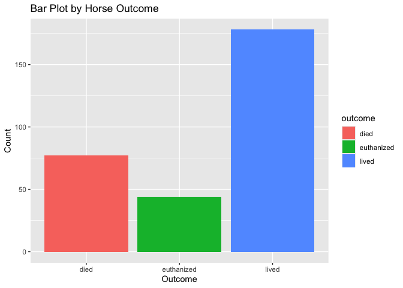<!-- -->

### Correlation Matrix

Below is the correlation matrix between the continuous predictors.
Overall, there aren’t many strong relationships among the continuous
variables. However, the most prominent one observed is a strong negative
correlation between ‘nasogastric_reflux_ph’ and ‘total_protein’, with a
correlation coefficient of -0.72. Additionally, there are positive
correlations between ‘nasogastric_reflux_ph’ and ‘abdomo_protein’, as
well as between pulse and ‘respiratory_rate.’ Conversely, there is a
negative correlation between ‘abdomo_protein’ and ‘total_protein’.

``` r
library(corrplot)
```

    ## corrplot 0.92 loaded

``` r
numeric_columns <- sapply(horse_data, is.numeric) # Finding the continuous predictors 
df_numeric <- subset(horse_data, select = numeric_columns)
correlation_matrix <- cor(df_numeric, use = "pairwise.complete.obs") # Creating the correlation matrix

# Using the corrplot function to plot the matrix, only keeping the upper triangular matrix
corrplot(correlation_matrix, method = "color", type = "upper", order = "hclust", tl.col = "black",
         tl.srt = 45, col = colorRampPalette(c("red", "white", "blue"))(100), addCoef.col = "black",
         number.cex = 0.7, cl.pos = "n", diag = FALSE)
```

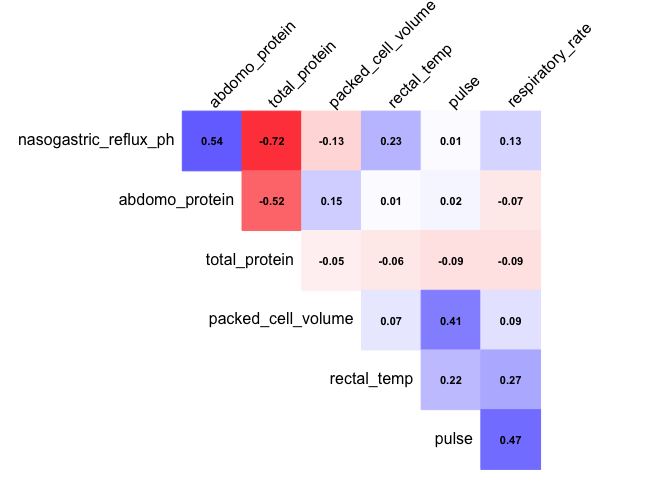<!-- -->

### Plots

Below are plots to visualise the relationship of each predictor with the
outcome variable.

**Density Plots**

Below are the density plots illustrating the influence of the continuous
variables on the categorical outcome. An interesting observation was
that horses that ultimately survived generally showed lower ‘pulse’
rates and a lower ‘packed_cell_volume’ compared to those that were
euthanized or deceased. However, the predictive power of
‘respiratory_rate’ appears to be less significant, as the distributions
for the categories ‘died’, ‘euthanized’, and ‘lived’ are relatively
similar.

``` r
horse_data %>%
  select(where(is.numeric), outcome) %>% # Selecting numeric rows 
  pivot_longer(- c(outcome), # Not plotting the "outcome" variable
    names_to = "metric",
    values_to = "value" ) %>%
  ggplot(aes(value, color = outcome)) + # Plotting the density plots 
  geom_density(alpha = 0.5) +
  facet_wrap(vars(metric), scales = "free", ncol = 3) +
  theme(panel.grid.major = element_blank(), panel.grid.minor = element_blank())
```

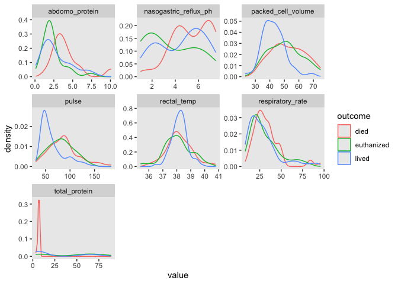<!-- -->

### Box Plots

Below are some box plots depicting the relationships between the
continuous variables and outcome. In general, most of the box plots do
not exhibit a strong, clear relationship between these predictors and
the final outcome for the horse. However, the plot of Outcome versus
packed_cell_volume does reveal some level of ordering among the
outcomes. It appears that a lower packed_cell_volume corresponds to a
higher chance of survival, which aligns with our observations from the
density plots.

``` r
library(patchwork)
# to only select the continuous variables
continuous_vars <- horse_data %>% 
  select(where(is.numeric)) #

# pdf("output_plots.pdf", width = 8, height = 10)

plots_continuous_box <- map(names(continuous_vars),
                            ~ ggplot(raw_df, aes(x = outcome, y = .data[[.x]], fill = outcome)) +
                              geom_boxplot() + # making a boxplot
                              labs(title = paste("Outcome vs", .x), y = .x) + # For labels 
                              theme_minimal() +
                              theme(axis.text.x = element_text(angle = 45, hjust = 1))
                            )
# To plot in a 2x2 grid
par(mfrow = c(2, 2)) 
wrap_plots(plots_continuous_box[1:4])
```

    ## Warning: Removed 60 rows containing non-finite outside the scale range
    ## (`stat_boxplot()`).

    ## Warning: Removed 24 rows containing non-finite outside the scale range
    ## (`stat_boxplot()`).

    ## Warning: Removed 58 rows containing non-finite outside the scale range
    ## (`stat_boxplot()`).

    ## Warning: Removed 246 rows containing non-finite outside the scale range
    ## (`stat_boxplot()`).

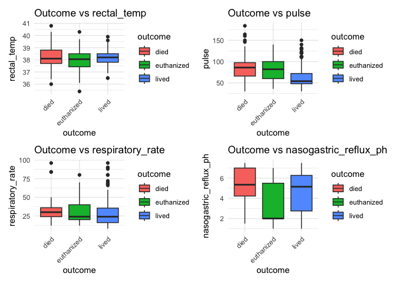<!-- -->

``` r
par(mfrow = c(2, 2)) 
wrap_plots(plots_continuous_box[5:7], ncol = 2)
```

    ## Warning: Removed 29 rows containing non-finite outside the scale range
    ## (`stat_boxplot()`).

    ## Warning: Removed 33 rows containing non-finite outside the scale range
    ## (`stat_boxplot()`).

    ## Warning: Removed 198 rows containing non-finite outside the scale range
    ## (`stat_boxplot()`).

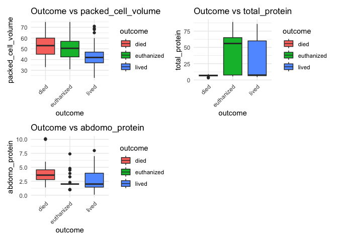<!-- -->

### Bar Plots

Below are some visualizations illustrating the impact of each
categorical predictor on the outcome. While there weren’t many distinct
patterns observed within the categorical predictors from these plots,
it’s noteworthy that a significant portion of the surviving horses
exhibited a ‘capillary_refill_time’ of less than 3 and ‘none/slight’
abdominal distention.

``` r
categorical_vars <- select(horse_data, -outcome) %>% # Extracting the categorical variable 
  select(where(~!is.numeric(.) & !is.logical(.)))

# Generate bar plots for categorical variables
plots_categorical <- map(names(categorical_vars), ~ggplot(raw_df, aes_string(x = .x, fill = 'outcome')) + 
                           geom_bar(position = "dodge") +
                           labs(title = paste("Outcome vs", .x), x = .x) +
                           theme_minimal() + # Adjusting text sizes
                           theme(axis.text.x = element_text(angle = 45, hjust = 1, size = 6),
                                 axis.text.y = element_text(size = 6), 
                                 axis.text = element_text(size = 6), 
                                 plot.title = element_text(size = 7), 
                                 axis.title = element_text(size = 7), 
                                 legend.text = element_text(size = 6), 
                                 legend.title = element_text(size = 6), 
                                 legend.key.size = unit(0.5, "lines"))
)
```

    ## Warning: `aes_string()` was deprecated in ggplot2 3.0.0.
    ## ℹ Please use tidy evaluation idioms with `aes()`.
    ## ℹ See also `vignette("ggplot2-in-packages")` for more information.
    ## This warning is displayed once every 8 hours.
    ## Call `lifecycle::last_lifecycle_warnings()` to see where this warning was
    ## generated.

``` r
# Splitting it up into two outputs to look nicer
wrap_plots(plots_categorical[1:9])
```

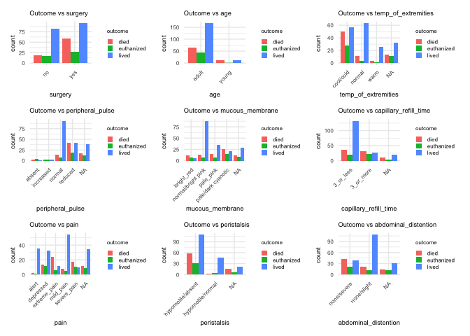<!-- -->

``` r
wrap_plots(plots_categorical[10:16])
```

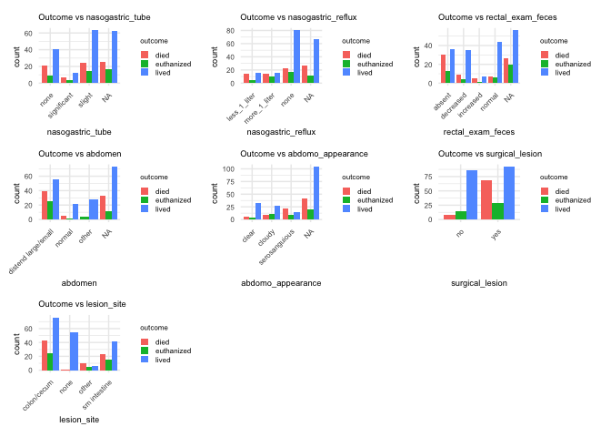<!-- -->

## Missing Data

The dataset presents a significant challenge due to the abundance of
missing data. Only 6 rows in the entire dataset had no missing values,
which is particularly concerning given the relatively small size of the
dataset, comprising of 299 rows. To address this issue, we adopted three
distinct approaches, which are elaborated upon below. In the report, we
will evaluate all models using these three methods and summarize the
findings.

### Complete Case Analysis

For our first method, we conducted a complete case analysis. In this
approach, columns with a significant number of missing values were
excluded, using a threshold of 15%. This threshold was selected to
minimize the loss of valuable data from the dataset. Ultimately, only
28% of the data was dropped, leaving 215 rows available for the complete
case analysis.

``` r
# Removing columns with more than 15% missing values

nas_per_column <- sapply(horse_data, function(x) sum(is.na(x)) / nrow(horse_data))
columns_to_remove <- names(nas_per_column[nas_per_column > 0.15]) # columns with more than 15% missing

horse_data_clean <- horse_data[, !(names(horse_data) %in% columns_to_remove)]

complete_case_df <- horse_data_clean[complete.cases(horse_data_clean), ]
nrow(complete_case_df) # Number of rows left (for complete case analysis)
```

    ## [1] 215

### missForest Imputation

For our second method, we decided to utlize the missForest package. This
package employs a random forest trained on the observed values to
conduct nonparametric missing value imputation. By using this method, we
ensure that all 299 rows in the dataset are retained, and no data is
lost during model training.

``` r
library(tidyverse)
library(missForest)

set.seed(123)

horse_copy_imputed <- as.data.frame(raw_df)

# Changing the non-numeric columns to factors
non_numeric_cols <- sapply(horse_copy_imputed, function(x) !is.numeric(x)) 
horse_copy_imputed[non_numeric_cols] <- lapply(horse_copy_imputed[non_numeric_cols], as.factor)

imputed_data <- missForest(horse_copy_imputed)

imputed_df <- imputed_data$ximp
sum(is.na(imputed_df)) # Check if there are any missing values remaining
```

    ## [1] 0

### Using Mean and Mode

The last method we employed involved replacing missing values with the
mean for continuous variables and the mode for categorical variables.
This approach also ensured that there were no missing data points when
fitting the models. However, a notable weakness of this method is that
it may not adequately capture the variability and nuances present in the
dataset. By imputing missing values with the mean or mode, we
essentially ignore potential patterns and relationships within the data.
Consequently, this method might lead to biased estimations and could
impact the accuracy of our models.

``` r
mean_mode_df <- raw_df

# Function to calculate mode
getMode <- function(v) {
  uniqv <- unique(v) 
  uniqv[which.max(tabulate(match(v, uniqv)))]
}

# Looping over each column
for (col_name in names(mean_mode_df)) {
  # Check if the column is numeric
  if (is.numeric(mean_mode_df[[col_name]])) {
    # Impute missing numeric values with mean
    mean_mode_df[[col_name]][is.na(mean_mode_df[[col_name]])] <- mean(mean_mode_df[[col_name]], na.rm = TRUE)
    } else {
      # Impute missing non-numeric values with mode if its categorical
      mode_value <- getMode(mean_mode_df[[col_name]][!is.na(mean_mode_df[[col_name]])])
      mean_mode_df[[col_name]][is.na(mean_mode_df[[col_name]])] <- mode_value
    }
}

sum(is.na(mean_mode_df)) # Check if there are any missing values remaining
```

    ## [1] 0

### Final Dataset

In this report, for illustrative purposes, we will fit all the models
using the missForest package as it was also utilized by various research
papers with the same dataset. All the results with all the datasets will
be reported at the end of the report.

``` r
df <- imputed_df
```

``` r
library(tidymodels)

## run this to split into training and testing
set.seed(123) # for reproducibility

data_split <- initial_split(df, prop = 0.75) # Using a 75% split 
final_df_training_data <- training(data_split)
test_data_df <- testing(data_split)
```

## Inbalanced Outcome Variable: Using SMOTE

The Synthetic Minority Over-sampling Technique (SMOTE) is an essential
tool in machine learning for tack- ling class imbalance, a common issue
where the number of instances of one class significantly exceeds those
of other classes. This imbalance often results in biased models that
favour the majority class, compromising the model’s performance on
minority classes. SMOTE addresses this by generating synthetic samples
of the minority classes through interpolation between each minority
class sample and its k-nearest neighbours in the feature space. This
enhances the minority class’s representation, aiding the model in
learning more generalised patterns and reducing the risk of overfitting
to the majority class. In the context of our dataset, which initially
shows a class distribution of “Died” at 62, “Euthanized” at 33, and
“Lived” at 129, we decided to apply SMOTE to create a balanced
distribution of 129 instances for each class. This ensures that our
models will equally consider each outcome during training, eliminating
bias towards the “Lived” class due to its numerical superiority. By
dividing the dataset into 75% for training and 25% for testing, and
applying SMOTE solely to the training data, this ensures that the models
are trained on a balanced dataset, which could enhance its
generalisation capability across all classes. Importantly, not applying
SMOTE to the testing data preserves the original class distribution,
offering a more accurate reflection of real-world scenarios and allowing
for a valid assessment of the model’s performance. For completeness, we
trained the models using both SMOTE and without SMOTE for comparison and
will show the results in the “Findings” section.

``` r
## Only run this if want to use SMOTE
library(themis) 
library(recipes) 
library(modeldata)

recipe_obj <- recipe(outcome ~ ., data = final_df_training_data) %>%
  step_impute_knn(all_predictors(), neighbors = 5) %>% 
  step_smotenc(outcome, over_ratio = 1, neighbors = 5) %>% 
  prep(data = final_df_training_data)


smote_final_df_training_data <- bake(recipe_obj, new_data = NULL)

# Before SMOTE
table(final_df_training_data$outcome)
```

    ## 
    ##       died euthanized      lived 
    ##         62         33        129

``` r
# After SMOTE
table(smote_final_df_training_data$outcome)
```

    ## 
    ##       died euthanized      lived 
    ##        129        129        129

## Model: Baseline

### Multinomial Logistic Regression

For our baseline model, we decided to a fit a multinomial logistic
regression model which included all the parameters, no parameter
selection was done. This model was chosen as our baseline due to its
simplicity and direct applicability to multi-class classification
problems. It serves as a straightforward method for comparison against
more complex models, allowing us to evaluate the value of using mode
advanced ma- chine learning techniques. With a testing accuracy of 0.65,
the model performs relatively well, especially considering that random
prediction of the outcome variable would only achieve a 0.38 accuracy
rate.

``` r
library(tidymodels)
library(parsnip)
library(nnet)

set.seed(123) # for reproducibility 

train_data <- final_df_training_data 
test_data <- test_data_df

multinom_model_spec <- multinom_reg() %>%
  set_engine("nnet") %>%
  set_mode("classification") # Use classification since data has categorical outcome

recipe <- recipe(outcome ~ ., data = train_data)

multinom_fit <- workflow() %>% 
  add_recipe(recipe) %>% 
  add_model(multinom_model_spec) %>% 
  fit(data = train_data)

predictions <- predict(multinom_fit, new_data = test_data, type = "prob") # This returns the probability

# in order to get the predicted class based on the highest probability
test_data_predictions <- test_data %>%
  select(outcome) %>%
  bind_cols(predictions) %>%
  mutate(pred_class = max.col(select(., -outcome), ties.method = "first")) # If two of the highest 

levels_pred <- levels(test_data$outcome)
test_data_predictions$pred_class <- factor(test_data_predictions$pred_class, levels = 1:length(levels_pred), labels =levels_pred) 

# For the corr matrix
metrics <- yardstick::metrics(test_data_predictions, truth = outcome, estimate = pred_class)
conf_mat <- yardstick::conf_mat(test_data_predictions, truth = outcome, estimate = pred_class)
 
knitr::kable(metrics, caption = "Metrics for Multinominal Model")
```

| .metric  | .estimator | .estimate |
|:---------|:-----------|----------:|
| accuracy | multiclass | 0.6533333 |
| kap      | multiclass | 0.3809524 |

Metrics for Multinominal Model

``` r
knitr::kable(conf_mat$table, caption = "Confusion Matrix for Multinominal Model")
```

|            | died | euthanized | lived |
|:-----------|-----:|-----------:|------:|
| died       |   11 |          1 |    11 |
| euthanized |    1 |          5 |     5 |
| lived      |    3 |          5 |    33 |

Confusion Matrix for Multinominal Model

### Coefficient of the Baseline Model

Each coefficient of a multinomial logistic regression model represents
the change in the log odds of being in one category compared to the
reference category, holding all other predictors constant. Here, the
reference category is died. Thus, if the coefficient of a predictor is
positive, it suggests that an increase in that variable is associated
with an increased likelihood of being in the particular outcome category
compared to the reference category. On the other hand, a negative
coefficient suggests a decreased likelihood.

``` r
library(knitr) 
library(kableExtra)
```

    ## 
    ## Attaching package: 'kableExtra'

    ## The following object is masked from 'package:dplyr':
    ## 
    ##     group_rows

``` r
model_coefficients <- coef(multinom_fit$fit$fit$fit) # To get model coefficients

coefficients_transposed <- t(model_coefficients) # Transposing

coefficients_df <- as.data.frame(coefficients_transposed)

# Add row names as a new column for variable names (since transposing shifts variable name
coefficients_df$Variable <- rownames(coefficients_df)

# Reordering the columns
desired_order <- c("lived", "euthanized") 
coefficients_df <- coefficients_df[, desired_order]

knitr::kable(coefficients_df, caption = "Multinominal Logistic Regression Model")
```

|                                   |       lived |  euthanized |
|:----------------------------------|------------:|------------:|
| (Intercept)                       | -16.3933161 | -11.2257403 |
| surgeryyes                        |  -8.1061037 | -13.7109252 |
| ageyoung                          | -14.1437962 | -14.8428597 |
| rectal_temp                       |   0.8497677 |   0.9069253 |
| pulse                             |   0.1710067 |   0.1994326 |
| respiratory_rate                  |   0.0932508 |   0.1079322 |
| temp_of_extremitiesnormal         |  -1.1111623 |  -3.9900299 |
| temp_of_extremitieswarm           |   3.9221368 |  -2.4214062 |
| peripheral_pulseincreased         | -12.3673316 |  13.5866240 |
| peripheral_pulsenormal            |   7.6786137 |  -3.5143933 |
| peripheral_pulsereduced           |   6.1679495 |  -2.8611112 |
| mucous_membranenormal/bright pink |   4.2326399 |   6.4188875 |
| mucous_membranepale_pink          |   8.5737374 |   8.6763092 |
| mucous_membranepale/dark cyanotic |   7.2735510 |   6.9401862 |
| capillary_refill_time3_or_more    |   8.1783576 |  10.9268357 |
| paindepressed                     |  12.1326643 |  11.3732443 |
| painextreme_pain                  |  -1.7976844 |   0.4461610 |
| painmild_pain                     |   4.0143019 |  -0.7091520 |
| painsevere_pain                   |   0.5818418 |   1.9361316 |
| peristalsishypomotile/normal      |  12.5167257 |  16.9849028 |
| abdominal_distentionnone/slight   |   4.8279184 |   3.0485667 |
| nasogastric_tubesignificant       |   9.5460425 |  10.2676993 |
| nasogastric_tubeslight            |   9.6648186 |  10.6759436 |
| nasogastric_refluxmore_1_liter    |   3.8029238 |   8.1348841 |
| nasogastric_refluxnone            |   5.9653654 |   7.8944541 |
| nasogastric_reflux_ph             |  -6.3515624 |  -7.7436646 |
| rectal_exam_fecesdecreased        |  -4.3948676 |  -0.0684369 |
| rectal_exam_fecesincreased        | -11.8507748 | -41.6568489 |
| rectal_exam_fecesnormal           |  -1.2070700 |   3.6811666 |
| abdomennormal                     |  -5.8393584 | -14.0006374 |
| abdomenother                      |  36.1276896 |  32.8876415 |
| packed_cell_volume                |  -0.3679479 |  -0.3777036 |
| total_protein                     |   1.1900121 |   1.2311494 |
| abdomo_appearancecloudy           |  -8.7118692 |  -5.1086433 |
| abdomo_appearanceserosanguious    | -19.5227727 | -20.8616765 |
| abdomo_protein                    |  -2.4298147 |  -1.8120175 |
| surgical_lesionyes                |  -0.4448261 |  -1.0203096 |
| lesion_sitenone                   |  18.6892502 | -10.1598073 |
| lesion_siteother                  |   3.0751080 |   3.6829846 |
| lesion_sitesm intestine           |   6.6043870 |   5.5355794 |

Multinominal Logistic Regression Model

## Model: Gradient Descent

### Stochastic Gradient Descent

This model is our own implementation of stochastic gradient descent on a
multinominal logisitic regression model, which optimises the
cross-entropy loss function iteratively. It first preprocesses that
dataset by converting categorical variables into numeric variables. The
model utlises functions for softmax calculation, cross-entropy loss
computation, and gradient descent. Through SGD, the model iteratively
updates weights to minimize the cross-entropy loss function, increasing
its predictive accuracy. The training process will span over multiple
epochs, with each epoch evaluating the model performance. The model’s
parameters have been carefully selected to optimize its performance. A
learning_rate of 0.0001, along with 150 epochs and a batch_size of 8,
were chosen to allow for convergence to a local minimum during training.
These parameter choices aim to strike a balance between model efficiency
and effectiveness, ensuring robust optimization while avoiding
overfitting. The final testing accuracy of the model after running over
150 epochs was 0.58.

``` r
library(tidyverse)

set.seed(123) # for reproducibility

train_data_sgd <- final_df_training_data %>%
  mutate(across(where(is.character), as.factor)) # to make sure all character columns are converted to factors

# need to make it start from 0 to use with the softmax function
train_data_sgd$outcome <- as.numeric(factor(train_data_sgd$outcome)) - 1 

test_data_sgd <- test_data
test_data_sgd$outcome <- as.numeric(factor(test_data_sgd$outcome)) - 1 

train_data <- train_data_sgd
test_data <- test_data_sgd

# have to one-hot encode categorical variables
X_train <- model.matrix(~ . - 1 - outcome, data = train_data) # The '- 1' removes intercept 
y_train <- train_data$outcome

# based on code from Dr. Loftus
softmax <- function(z) {
  z_max <- apply(z, 1, max) # to find the max value in each row
  exp_z <- exp(z - z_max) # subtract the max value from each row for numerical stability
  exp_z / rowSums(exp_z)
  return(exp_z)
}

cross_entropy_loss <- function(X, y, W) { 
  n <- nrow(X)
  logits <- X %*% W
  probs <- softmax(logits)
  epsilon <- 1e-9 # small constant to avoid log(0)
  -sum(log(probs[cbind(1:n, y + 1)] + epsilon)) / n 

}

cross_entropy_gradient <- function(X, y, W) { 
  #print("in cross entropy)")
  n <- nrow(X)
  k <- ncol(W)
  logits <- X %*% W # calculate logits
  probs <- softmax(logits) # use softmax to get the class probs
  y_mat <- matrix(0, n, k) # initialize a matrix of zeros for the one-hot encoded target variable 
  
  y_mat[cbind(1:n, y + 1)] <- 1 # One-hot encode the target variable
  
  
  grad <- t(X) %*% (probs - y_mat) / n # calculate the gradient
  
  return(grad)
}

sgd_multinomial_logistic <- function(X, y, learning_rate = 0.0001, epochs = 150, batch_size = 8){
  #print("line 1")
  n <- nrow(X)
  p <- ncol(X)
  k <- length(unique(y)) # Number of classes
  W <- matrix(rnorm(p * k), p, k) # to initialise the weights randomly
  
  
  metrics <- data.frame(epoch = integer(0), loss = numeric(0), accuracy = numeric(0)) # to store metrics
  
  
  for (epoch in 1:epochs) {
    shuffled_indices <- sample(1:n) # Shuffle indices for stochasticity 
    X_shuffled <- X[shuffled_indices, ]
    y_shuffled <- y[shuffled_indices]

    for (i in seq(from = 1, to = n, by = batch_size)) { 
      

      # to define the current batch
      batch_indices = i:min(i + batch_size - 1, n) 
      X_batch = X_shuffled[batch_indices, , drop = FALSE] 
      y_batch = y_shuffled[batch_indices]
      
  
      gradient_batch <- cross_entropy_gradient(X_batch, y_batch, W) # calculate the gradient
      W <- W - learning_rate * gradient_batch # updating the weights 

      
    }
    # calculating the loss and accuracy for each epoch
    
    loss <- cross_entropy_loss(X, y, W)
    predictions <- apply(X %*% W, 1, which.max) - 1 # minus 1 to align with zero-indexed 'y' 
    correct_predictions <- sum(predictions == y)
    accuracy <- correct_predictions / n
    metrics <- rbind(metrics, data.frame(epoch = epoch, loss = loss, accuracy = accuracy))
    if (epoch %% 10 == 0) {
      cat("Epoch:", epoch, "Loss:", loss, "Accuracy:", accuracy, "\n")
    }
  }
  return(list(W = W, metrics = metrics))
}

results <- sgd_multinomial_logistic(X_train, y_train)
```

    ## Epoch: 10 Loss: 11.68223 Accuracy: 0.3660714 
    ## Epoch: 20 Loss: 11.36371 Accuracy: 0.375 
    ## Epoch: 30 Loss: 10.98271 Accuracy: 0.375 
    ## Epoch: 40 Loss: 9.285201 Accuracy: 0.3928571 
    ## Epoch: 50 Loss: 7.230734 Accuracy: 0.4553571 
    ## Epoch: 60 Loss: 6.478095 Accuracy: 0.5044643 
    ## Epoch: 70 Loss: 5.799594 Accuracy: 0.5401786 
    ## Epoch: 80 Loss: 5.231257 Accuracy: 0.5401786 
    ## Epoch: 90 Loss: 4.825534 Accuracy: 0.5580357 
    ## Epoch: 100 Loss: 4.539848 Accuracy: 0.5848214 
    ## Epoch: 110 Loss: 4.368991 Accuracy: 0.5758929 
    ## Epoch: 120 Loss: 4.220976 Accuracy: 0.5848214 
    ## Epoch: 130 Loss: 4.12787 Accuracy: 0.5848214 
    ## Epoch: 140 Loss: 4.058952 Accuracy: 0.5714286 
    ## Epoch: 150 Loss: 3.958112 Accuracy: 0.5848214

``` r
# plot of accuracy vs epochs
results$metrics %>%
  ggplot(aes(x = epoch, y = accuracy)) + 
  geom_point() + 
  geom_line() + 
  ggtitle("Accuracy over Epochs") + 
  ylab("Accuracy") + 
  xlab("Epoch")
```

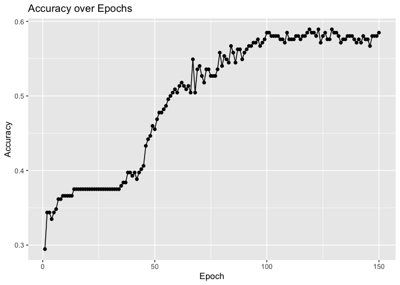<!-- -->

## Model: Non-Baseline (Interpretability)

Here are some non-baseline models primarily focused on interpretability.

### Single Decision Tree

A single decision tree was selected as the model focused on
interpretability. This model offers clear insights into how different
features influence the survival outcome of horses. This model satisfies
the requirement for an interpretable model, as it is relatively easier
to interpret compared to the baseline to explain the predictions based
on the structure of the tree. One can simply view the tree and
understand how the model is making its predictions.

The model achieves a test accuracy of 0.73, which is better compared to
the baseline. It still demonstrates a relatively high accuracy rate,
considering its simplicity and focus on interpretability rather than
predictive capability. Such models are valuable in real-world scenarios
where understanding the inner workings of the model is crucial and
preferable to relying on complex black-box algorithms.

The primary advantage of a decision tree lies in its interpretability.
By examining the tree diagram, you can easily understand how the tree
classifies the data. For instance, if a horse has a pulse greater than
or equal to 65, an abdomo_protein less than 2.7, and ‘mild pain’ for the
pain category, the tree predicts that the horse lived. Similarly, one
can navigate the decision tree to classify each observation accordingly.

The distribution of predictions on the training data indicates 31% for
‘died’, 6% for ‘euthanized’, and 63% for ‘lived’, aligning closely with
the distribution of the outcome variable. Overall, the predictions of
the tree model make sense. For example, you would expect a horse with a
higher pulse to have a higher likelihood of not surviving. Similarly, it
is intuitive that a horse with ‘mild pain’ is more likely to survive
compared to a horse with ‘severe pain’.

The coefficient values for `pulse` and `abdomo_protein`, which are
continuous predictors, along with `pain_mild_pain`, a categorical
predictor, are notably high, aligning with the baseline model. Most of
the interpretations derived from the decision tree are consistent with
the baseline model. For example, the coefficient for `pain_mild_pain` is
8.6 for ‘lived’ and 5.1 for ‘euthanized’, indicating that experiencing
‘mild pain’ significantly raises the likelihood of survival or
euthanasia compared to death. However, the interpretation does not align
regarding the pulse variable. While the baseline model suggests that a
higher pulse increases the chances of survival, the decision tree
indicates that a horse with a pulse of less than 65 is much more likely
to survive.

``` r
#### single decision tree

library(tidymodels) 
library(rpart) 
```

    ## 
    ## Attaching package: 'rpart'

    ## The following object is masked from 'package:dials':
    ## 
    ##     prune

``` r
library(knitr)

set.seed(123) # for reproducibility 
data_train <- final_df_training_data 
data_test <- test_data_df

data_recipe <- recipe(outcome ~ ., data = data_train) %>% 
  step_normalize(all_numeric_predictors()) %>% 
  step_dummy(all_nominal_predictors())

# Model specification with tunable parameters
data_tree <- decision_tree( 
  tree_depth = tune(), 
  cost_complexity = tune(), 
  min_n = tune()
) %>%
  set_engine("rpart") %>% 
  set_mode("classification")

data_workflow_tree <- workflow() %>% 
  add_recipe(data_recipe) %>% 
  add_model(data_tree)

# Define the tuning grid
grid <- grid_regular(
  tree_depth(range = c(1, 5)),
  cost_complexity(c(-5, 0)), # Converting to log scale for tuning 
  min_n(range = c(2, 20)),
  levels = 5 # number of levels for each tuning parameter
)
# Cross-validation for tuning
data_cv <- vfold_cv(data_train, v = 10, strata = outcome)

# Performing the tuning
data_fit_tree <- tune_grid( 
  data_workflow_tree, 
  resamples = data_cv,
  grid = grid, 
  metrics = metric_set(accuracy)
)
```

``` r
# Getting the best parameters and fitting the model with the best parameters
data_tree_best <- select_best(data_fit_tree, metric = "accuracy")
data_tree_final <- finalize_workflow(data_workflow_tree, data_tree_best) 
final_fit <- fit(data_tree_final, data = data_train)

# Evaluate the model on the test set
predictions <- predict(final_fit, new_data = data_test, type = "prob") 
data_test$predicted_class <- predict(final_fit, new_data = data_test, type = "class")$.pred_class

# To get accuracy and confusion matrix
metrics <- yardstick::metrics(data_test, truth = outcome, estimate = predicted_class) 
conf_mat <- yardstick::conf_mat(data_test, truth = outcome, estimate = predicted_class)

knitr::kable(metrics, caption = "Metrics for Single Tree Model")
```

| .metric  | .estimator | .estimate |
|:---------|:-----------|----------:|
| accuracy | multiclass | 0.7333333 |
| kap      | multiclass | 0.5009980 |

Metrics for Single Tree Model

``` r
knitr::kable(conf_mat$table, caption = "Confusion Matrix for Single Tree Model")
```

|            | died | euthanized | lived |
|:-----------|-----:|-----------:|------:|
| died       |   11 |          2 |     8 |
| euthanized |    0 |          6 |     3 |
| lived      |    4 |          3 |    38 |

Confusion Matrix for Single Tree Model

``` r
data_tree_best %>% 
  knitr::kable()
```

| cost_complexity | tree_depth | min_n | .config                |
|----------------:|-----------:|------:|:-----------------------|
|           1e-05 |          5 |     2 | Preprocessor1_Model005 |

``` r
data_fit_tree %>% autoplot() # Tuning parameters of tree
```

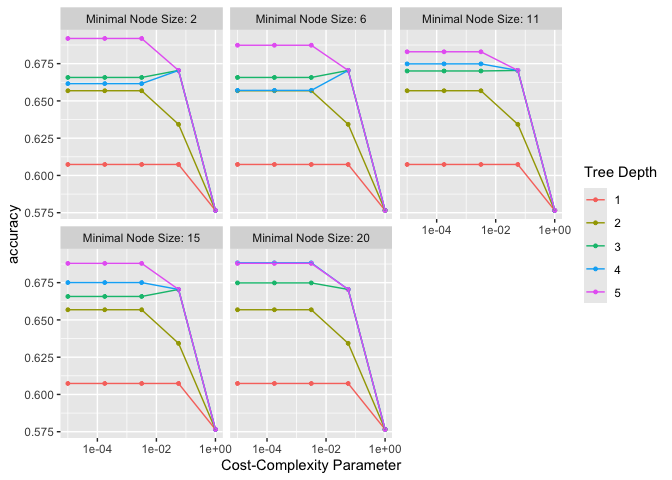<!-- -->

Below is a plot of the diagram of the tree model. From this we can see
that. . . (do after finalising the code)

``` r
library(rpart.plot)

# To print out the tree
final_model <- pull_workflow_fit(final_fit)

tree_model <- final_model$fit 
rpart.plot(tree_model, roundint = FALSE)
```

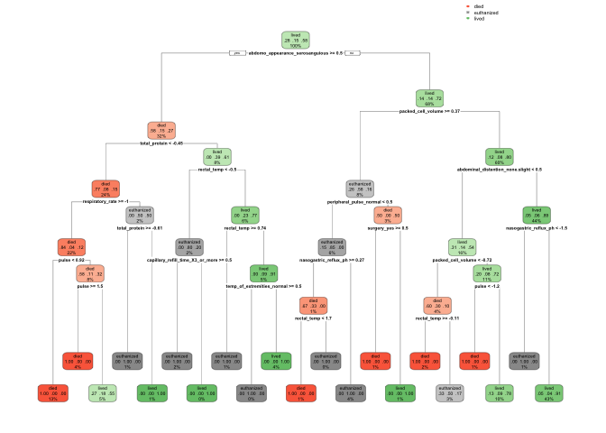<!-- -->

## Model: Non-Baseline (Interpretability)

For a high-dimensional model, we are going to fit 4 penalized regression
models. Lasso, lasso with interactions, ridge regression and ElasticNet
Regression. All four of these methods add a penalty term to a model’s
objective function. It penalizes the complexity of the model or the size
of the coefficients, which encourage simpler models and avoids
overfitting.

All the penalized regression methods all achieved a similar test
prediction accuracy of around .7. This indicates that there is no clear
winner for which model is the best for predicting horse survival rate.
However, all of these models performed substantially better than the
baseline with a prediction accuracy of 0.65 which is really intuitive as
the dataset could be considered high-dimensional given the small number
of rows.

### Lasso Regression

Lasso applies a penalty on the absolute size of coefficients,
effectively performing variable selection by shrink- ing the
coefficients of the less important features to zero, effectively
removing them from the model. This allows the model to identify the most
relevant predictors, simplifying the model, making it identify the more
important predictors better than the baseline. This model has a testing
accuracy of 0.70.

``` r
#### lasso

library(tidymodels) 
library(glmnet)
```

    ## Loading required package: Matrix

    ## 
    ## Attaching package: 'Matrix'

    ## The following objects are masked from 'package:tidyr':
    ## 
    ##     expand, pack, unpack

    ## Loaded glmnet 4.1-8

``` r
library(broom)
library(knitr)

set.seed(123) # for reproducibility 
train_data <- final_df_training_data 
test_data <- test_data_df


recipe <- recipe(outcome ~ ., data = train_data) %>% 
  step_dummy(all_nominal(), -all_outcomes()) %>% 
  step_zv(all_predictors()) %>% # for zero variance 
  step_normalize(all_numeric(), -all_outcomes())

# model specification for multinomial logistic regression
lasso_spec <- multinom_reg(penalty = tune(), mixture = 1) %>% 
  set_engine("glmnet") %>%
  set_mode("classification")

# workflow
workflow <- workflow() %>% 
  add_recipe(recipe) %>% 
  add_model(lasso_spec)

cv <- vfold_cv(train_data, v = 5, strata = outcome)
penalty_range <- dials::penalty(range = c(-6, -1), trans = log10_trans()) # to find the optimal value

# tuning
tune_results <- tune_grid(
  workflow,
  resamples = cv,
  grid = dials::grid_latin_hypercube(penalty_range, 
                                     size = 20),
  metrics = metric_set(yardstick::accuracy) 
)
```

    ## → A | warning: from glmnet C++ code (error code -94); Convergence for 94th lambda value not reached after maxit=100000 iterations; solutions for larger lambdas returned

    ## There were issues with some computations   A: x1                                                 → B | warning: from glmnet C++ code (error code -87); Convergence for 87th lambda value not reached after maxit=100000 iterations; solutions for larger lambdas returned
    ## There were issues with some computations   A: x1There were issues with some computations   A: x1   B: x1                                                         → C | warning: from glmnet C++ code (error code -79); Convergence for 79th lambda value not reached after maxit=100000 iterations; solutions for larger lambdas returned
    ## There were issues with some computations   A: x1   B: x1There were issues with some computations   A: x1   B: x1   C: x1There were issues with some computations   A: x1   B: x1   C: x1

``` r
# to get the best result based on accuracy
best_results <- select_best(tune_results, metric = "accuracy") 
best_lambda <- best_results$penalty

# making the model again using the best lambda
final_lasso_spec <- multinom_reg(penalty = best_lambda, mixture = 1) %>% 
  set_engine("glmnet") %>%
  set_mode("classification")

# refit on the whole training dataset
final_workflow <- workflow() %>% 
  add_recipe(recipe) %>% 
  add_model(final_lasso_spec) %>% 
  fit(data = train_data)

predictions <- predict(final_workflow, new_data = test_data, type = "prob") 

max_prob <- apply(predictions, 1, which.max)
test_data$.pred_class <- levels(test_data$outcome)[max_prob] 

# model metrics
metrics <- sum(test_data$.pred_class == test_data$outcome)/nrow(test_data) 
print(metrics)
```

    ## [1] 0.7066667

``` r
# to see the coefficients
best_lambda_numeric <- as.numeric(best_lambda)

final_model <- final_workflow %>% 
  pull_workflow_fit() %>% 
  pluck("fit")

# extract coefficients as a list of matrices
coefficients_list <- coef(final_model, s = best_lambda_numeric)

combined_coefficients <- data.frame()

for (class_name in names(coefficients_list)) { 
  # convert to df
  class_coefficients_df <- as.data.frame(as.matrix(coefficients_list[[class_name]])) 
  
  # add column with class name
  class_coefficients_df$class <- class_name
  
  class_coefficients_df$predictor <- rownames(as.matrix(coefficients_list[[class_name]]))
  combined_coefficients <- rbind(combined_coefficients, class_coefficients_df) 
}

# Rename the columns
colnames(combined_coefficients)[1] <- "estimate"

# need to use pivot longer for df
combined_coefficients_df <- combined_coefficients %>% 
  pivot_wider(names_from = class, values_from = estimate)

kable(combined_coefficients_df, caption = "Lasso")
```

| predictor                          |       died | euthanized |      lived |
|:-----------------------------------|-----------:|-----------:|-----------:|
| (Intercept)                        | -0.7358850 | -0.6047720 |  1.3406570 |
| rectal_temp                        | -0.1460803 |  0.0000000 |  0.0000000 |
| pulse                              |  0.0000000 |  0.0010985 |  0.0000000 |
| respiratory_rate                   |  0.0000000 |  0.0000000 |  0.0021272 |
| nasogastric_reflux_ph              |  0.8541515 | -0.2482890 |  0.0000000 |
| packed_cell_volume                 |  0.1276016 |  0.0000000 | -0.2068444 |
| total_protein                      | -0.8470974 |  0.2643994 |  0.0000000 |
| abdomo_protein                     |  0.5644338 |  0.0000000 |  0.0000000 |
| surgery_yes                        |  0.1673819 | -0.4564993 |  0.0000000 |
| age_young                          |  0.2278028 | -0.1091225 |  0.0000000 |
| temp_of_extremities_normal         |  0.0000000 | -0.2221638 |  0.0928862 |
| temp_of_extremities_warm           |  0.0000000 | -0.0410975 |  0.1129953 |
| peripheral_pulse_increased         |  0.0000000 |  0.3105590 |  0.0000000 |
| peripheral_pulse_normal            |  0.0000000 | -0.0264947 |  0.0589510 |
| peripheral_pulse_reduced           |  0.0000000 |  0.0000000 |  0.0000000 |
| mucous_membrane_normal.bright.pink |  0.0000000 |  0.0000000 |  0.0000000 |
| mucous_membrane_pale_pink          | -0.0775931 |  0.0000000 |  0.0877774 |
| mucous_membrane_pale.dark.cyanotic | -0.0183895 |  0.0000000 |  0.0036878 |
| capillary_refill_time_X3_or_more   | -0.1343949 |  0.2579852 |  0.0000000 |
| pain_depressed                     | -0.3851353 |  0.0066492 |  0.0000000 |
| pain_extreme_pain                  |  0.3580333 |  0.0000000 | -0.0103853 |
| pain_mild_pain                     |  0.0000000 | -0.1560061 |  0.1554890 |
| pain_severe_pain                   |  0.0000000 |  0.0000000 | -0.3898396 |
| peristalsis_hypomotile.normal      | -0.5173424 |  0.0000000 |  0.0000000 |
| abdominal_distention_none.slight   |  0.0000000 |  0.0000000 |  0.2147783 |
| nasogastric_tube_significant       | -0.0811707 |  0.0000000 |  0.0000000 |
| nasogastric_tube_slight            | -0.3031705 |  0.0000000 |  0.0000000 |
| nasogastric_reflux_more_1_liter    |  0.0000000 |  0.1967305 |  0.0000000 |
| nasogastric_reflux_none            |  0.0000000 |  0.0000000 |  0.1041308 |
| rectal_exam_feces_decreased        |  0.0000000 |  0.0000000 |  0.0000000 |
| rectal_exam_feces_increased        |  0.2870748 | -0.0027874 |  0.0000000 |
| rectal_exam_feces_normal           |  0.0000000 |  0.1754644 |  0.0000000 |
| abdomen_normal                     |  0.0000000 | -0.1747443 |  0.0000000 |
| abdomen_other                      | -0.7589506 |  0.0000000 |  0.1961646 |
| abdomo_appearance_cloudy           |  0.0000000 |  0.3188955 | -0.0982709 |
| abdomo_appearance_serosanguious    |  0.6287445 |  0.0000000 | -0.0775653 |
| surgical_lesion_yes                |  0.0000000 |  0.0000000 |  0.0000000 |
| lesion_site_none                   |  0.0000000 |  0.0000000 |  0.7691968 |
| lesion_site_other                  |  0.0000000 |  0.0000000 |  0.0000000 |
| lesion_site_sm.intestine           |  0.0000000 |  0.0000000 |  0.0000000 |

Lasso

``` r
library(yardstick)

## to get the confusion matrix
test_data$.pred_class <- as.factor(test_data$.pred_class)
conf_matrix <- conf_mat(test_data, truth = outcome, estimate = .pred_class)

# printing in knitr
knitr::kable(conf_matrix$table, caption = "Confusion Matrix for Lasso Model")
```

|            | died | euthanized | lived |
|:-----------|-----:|-----------:|------:|
| died       |   12 |          1 |    10 |
| euthanized |    0 |          3 |     1 |
| lived      |    3 |          7 |    38 |

Confusion Matrix for Lasso Model

### Lasso with Interactions

Our second candidate for a high-dimensional model is a Lasso model with
interactions, similar to the previous one. It adds a penalty term that
is the sum of the absolute values of the coefficients multiplied by a
tuning parameter. However, to increase the model’s complexity, we
explored several interaction terms based on our understanding of these
variables in real life. Adding interactions increases complexity to the
basic lasso model, potentially uncovering intricate relationships
between predictors and the response variable. In the future we might try
using all interactions and let lasso choose them for you. It is expected
that accuracy is higher without oversampling, so it would be better to
compare categories with/without merging while keeping oversampling
constant.

Interactions involving age and surgery did not improve the model’s
predictive accuracy. The model achieves a test prediction accuracy of
0.70.

``` r
#### lasso with interactions
library(tidymodels) 
library(glmnet) 
library(dplyr)

set.seed(123) # for reproducibility 
train_data <- final_df_training_data 
test_data <- test_data_df

recipe <- recipe(outcome ~ ., data = train_data) %>% 
  step_dummy(all_nominal(), -all_outcomes()) %>% 
  step_zv(all_predictors()) %>% 
  step_normalize(all_numeric(), -all_outcomes())

recipe <- recipe %>%
  step_mutate(age_surgery_interaction = age_young * surgery_yes) # adjust to change interactions

# model specification for multinomial logistic regression
lasso_spec <- multinom_reg(penalty = tune(), mixture = 1) %>% 
  set_engine("glmnet") %>%
  set_mode("classification")

# workflow
workflow <- workflow() %>% 
  add_recipe(recipe) %>% 
  add_model(lasso_spec)

cv <- vfold_cv(train_data, v = 5, strata = outcome)
penalty_range <- dials::penalty(range = c(-6, -1), trans = log10_trans())

# tuning using grid search to find the best parameters
tune_results <- tune_grid( 
  workflow,
  resamples = cv,
  grid = dials::grid_latin_hypercube(penalty_range, 
                                     size = 20),
  metrics = metric_set(yardstick::accuracy)
)
```

    ## → A | warning: from glmnet C++ code (error code -83); Convergence for 83th lambda value not reached after maxit=100000 iterations; solutions for larger lambdas returned

    ## There were issues with some computations   A: x1                                                 → B | warning: from glmnet C++ code (error code -85); Convergence for 85th lambda value not reached after maxit=100000 iterations; solutions for larger lambdas returned
    ## There were issues with some computations   A: x1There were issues with some computations   A: x1   B: x1                                                         → C | warning: from glmnet C++ code (error code -84); Convergence for 84th lambda value not reached after maxit=100000 iterations; solutions for larger lambdas returned
    ## There were issues with some computations   A: x1   B: x1There were issues with some computations   A: x1   B: x1   C: x1                                                                 → D | warning: from glmnet C++ code (error code -88); Convergence for 88th lambda value not reached after maxit=100000 iterations; solutions for larger lambdas returned
    ## There were issues with some computations   A: x1   B: x1   C: x1There were issues with some computations   A: x1   B: x1   C: x1   D: x1There were issues with some computations   A: x1   B: x1   C: x1   D: x1

``` r
# to get the best result based on accuracy
best_results <- select_best(tune_results, metric = "accuracy") 
best_lambda <- best_results$penalty

# making the model again using the best lambda
final_lasso_spec <- multinom_reg(penalty = best_lambda, mixture = 1) %>% 
  set_engine("glmnet") %>%
  set_mode("classification")

# refit on the whole training dataset
final_workflow <- workflow() %>% 
  add_recipe(recipe) %>% 
  add_model(final_lasso_spec) %>% 
  fit(data = train_data)

predictions <- predict(final_workflow, new_data = test_data, type = "prob") 

max_prob <- apply(predictions, 1, which.max)
test_data$.pred_class <- levels(test_data$outcome)[max_prob] 

# model metrics
metrics <- sum(test_data$.pred_class == test_data$outcome)/nrow(test_data) 
print(metrics)
```

    ## [1] 0.7066667

``` r
# to see the coefficients
best_lambda_numeric <- as.numeric(best_lambda)

final_model <- final_workflow %>% 
  pull_workflow_fit() %>% 
  pluck("fit")

# extract coefficients as a list of matrices
coefficients_list <- coef(final_model, s = best_lambda_numeric) 
combined_coefficients <- data.frame()

for (class_name in names(coefficients_list)) { 
  # convert to df
  class_coefficients_df <- as.data.frame(as.matrix(coefficients_list[[class_name]]))
  
  # add column with class name
  class_coefficients_df$class <- class_name
  class_coefficients_df$predictor <- rownames(as.matrix(coefficients_list[[class_name]]))
  combined_coefficients <- rbind(combined_coefficients, class_coefficients_df) 
}

# Rename the columns appropriately
colnames(combined_coefficients)[1] <- "estimate"
# need to use pivot longer for df
combined_coefficients_df <- combined_coefficients %>% 
  pivot_wider(names_from = class, values_from = estimate)

kable(combined_coefficients_df, caption = "Lasso with Interactions")
```

| predictor                          |       died | euthanized |      lived |
|:-----------------------------------|-----------:|-----------:|-----------:|
| (Intercept)                        | -0.4995088 | -0.5972171 |  1.0967259 |
| rectal_temp                        | -0.0459276 |  0.0000000 |  0.0000000 |
| pulse                              |  0.0000000 |  0.0000000 |  0.0000000 |
| respiratory_rate                   |  0.0000000 |  0.0000000 |  0.0000000 |
| nasogastric_reflux_ph              |  0.5090838 | -0.2364459 |  0.0000000 |
| packed_cell_volume                 |  0.0000000 |  0.0000000 | -0.3290688 |
| total_protein                      | -0.7779357 |  0.1530044 |  0.0000000 |
| abdomo_protein                     |  0.3443327 |  0.0000000 |  0.0000000 |
| surgery_yes                        |  0.1128331 | -0.1960482 |  0.0000000 |
| age_young                          |  0.1775941 |  0.0000000 |  0.0000000 |
| temp_of_extremities_normal         |  0.0000000 | -0.0629037 |  0.0587468 |
| temp_of_extremities_warm           |  0.0000000 |  0.0000000 |  0.0066774 |
| peripheral_pulse_increased         |  0.0000000 |  0.2619861 |  0.0000000 |
| peripheral_pulse_normal            |  0.0000000 |  0.0000000 |  0.0969806 |
| peripheral_pulse_reduced           |  0.0000000 |  0.0000000 |  0.0000000 |
| mucous_membrane_normal.bright.pink |  0.0000000 |  0.0000000 |  0.0000000 |
| mucous_membrane_pale_pink          | -0.0328633 |  0.0000000 |  0.0115756 |
| mucous_membrane_pale.dark.cyanotic |  0.0000000 |  0.0000000 |  0.0000000 |
| capillary_refill_time_X3_or_more   |  0.0000000 |  0.2097709 |  0.0000000 |
| pain_depressed                     | -0.1201928 |  0.0000000 |  0.0000000 |
| pain_extreme_pain                  |  0.3457508 |  0.0000000 |  0.0000000 |
| pain_mild_pain                     |  0.0000000 | -0.1259592 |  0.0440614 |
| pain_severe_pain                   |  0.0000000 |  0.0000000 | -0.4063553 |
| peristalsis_hypomotile.normal      | -0.2436080 |  0.0000000 |  0.0000000 |
| abdominal_distention_none.slight   |  0.0000000 |  0.0000000 |  0.2209522 |
| nasogastric_tube_significant       |  0.0000000 |  0.0000000 |  0.0000000 |
| nasogastric_tube_slight            | -0.0749840 |  0.0000000 |  0.0000000 |
| nasogastric_reflux_more_1_liter    |  0.0000000 |  0.0907175 |  0.0000000 |
| nasogastric_reflux_none            |  0.0000000 |  0.0000000 |  0.0962827 |
| rectal_exam_feces_decreased        |  0.0000000 |  0.0000000 |  0.0000000 |
| rectal_exam_feces_increased        |  0.1842350 |  0.0000000 |  0.0000000 |
| rectal_exam_feces_normal           |  0.0000000 |  0.0000000 |  0.0000000 |
| abdomen_normal                     |  0.0000000 |  0.0000000 |  0.0000000 |
| abdomen_other                      | -0.4718163 |  0.0000000 |  0.1180121 |
| abdomo_appearance_cloudy           |  0.0000000 |  0.3011130 |  0.0000000 |
| abdomo_appearance_serosanguious    |  0.4598867 |  0.0000000 | -0.0365638 |
| surgical_lesion_yes                |  0.0000000 |  0.0000000 |  0.0000000 |
| lesion_site_none                   |  0.0000000 |  0.0000000 |  0.5288431 |
| lesion_site_other                  |  0.0000000 |  0.0000000 |  0.0000000 |
| lesion_site_sm.intestine           |  0.0000000 |  0.0000000 |  0.0000000 |
| age_surgery_interaction            |  0.0000000 |  0.0000000 |  0.0000000 |

Lasso with Interactions

``` r
library(yardstick)

# for the confusion matrix
test_data$.pred_class <- as.factor(test_data$.pred_class)
conf_matrix <- conf_mat(test_data, truth = outcome, estimate = .pred_class)

# printing in knitr
knitr::kable(conf_matrix$table, caption = "Confusion Matrix for Lasso Model with Interactions")
```

|            | died | euthanized | lived |
|:-----------|-----:|-----------:|------:|
| died       |   11 |          1 |     9 |
| euthanized |    0 |          3 |     1 |
| lived      |    4 |          7 |    39 |

Confusion Matrix for Lasso Model with Interactions

### Ridge Regression

We applied Ridge Regression as our third candidate for our high
dimensional (penalized regression) model. This method adds a penalty
term that is the sum of the squares of the coefficients multiplied by a
tuning parameter. Adding this penalty term usually encourages smaller
coefficients, although it typically does not force them to be zero.
Ridge regression is beneficial for stabilizing the model and reducing
the variance of the estimates. This model has a test accuracy of 0.69.

``` r
#### ridge

library(tidymodels) 
library(glmnet)

set.seed(123) # for reproducibility 
train_data <- final_df_training_data 
test_data <- test_data_df

recipe <- recipe(outcome ~ ., data = train_data) %>% 
  step_dummy(all_nominal(), -all_outcomes()) %>% 
  step_zv(all_predictors()) %>% 
  step_normalize(all_numeric(), -all_outcomes())

# Model specification for multinomial logistic regression with ridge
ridge_spec <- multinom_reg(penalty = tune(), mixture = 0) %>% 
  set_engine("glmnet") %>%
  set_mode("classification")

# Workflow
workflow <- workflow() %>% 
  add_recipe(recipe) %>% 
  add_model(ridge_spec)

cv <- vfold_cv(train_data, v = 5, strata = outcome)
penalty_range <- dials::penalty(range = c(-6, -1), trans = log10_trans())

# Tuning using grid search to find the best parameters
tune_results <- tune_grid(
  workflow,
  resamples = cv,
  grid = dials::grid_latin_hypercube(penalty_range, size = 20), 
  metrics = metric_set(yardstick::accuracy)
)

# To get the best result based on accuracy
best_results <- select_best(tune_results, metric = "accuracy") 
best_lambda <- best_results$penalty

# Making the model again using the best lambda
final_ridge_spec <- multinom_reg(penalty = best_lambda, mixture = 0) %>% 
  set_engine("glmnet") %>%
  set_mode("classification")

# Refit on the whole training dataset
final_workflow <- workflow() %>% 
  add_recipe(recipe) %>% 
  add_model(final_ridge_spec) %>% 
  fit(data = train_data)

predictions <- predict(final_workflow, new_data = test_data, type = "prob") 

max_prob <- apply(predictions, 1, which.max)
test_data$.pred_class <- levels(test_data$outcome)[max_prob]

# Model metrics
metrics <- sum(test_data$.pred_class == test_data$outcome) / nrow(test_data) 
print(metrics)
```

    ## [1] 0.6933333

``` r
# to see the coefficients
best_lambda_numeric <- as.numeric(best_lambda)
final_model <- final_workflow %>% 
  pull_workflow_fit() %>% 
  pluck("fit")

# extract coefficients as a list of matrices
coefficients_list <- coef(final_model, s = best_lambda_numeric) 
combined_coefficients <- data.frame()

for (class_name in names(coefficients_list)) {
  # convert to df
  class_coefficients_df <- as.data.frame(as.matrix(coefficients_list[[class_name]]))
  
  # add column with class name
  class_coefficients_df$class <- class_name
  class_coefficients_df$predictor <- rownames(as.matrix(coefficients_list[[class_name]])) 
  combined_coefficients <- rbind(combined_coefficients, class_coefficients_df)
}

# Rename the columns appropriately
colnames(combined_coefficients)[1] <- "estimate"

# need to use pivot longer for df
combined_coefficients_df <- combined_coefficients %>% 
  pivot_wider(names_from = class, values_from = estimate)

kable(combined_coefficients_df, caption = "Ridge")
```

| predictor                          |       died | euthanized |      lived |
|:-----------------------------------|-----------:|-----------:|-----------:|
| (Intercept)                        | -0.4851246 | -0.7267144 |  1.2118390 |
| rectal_temp                        | -0.1218999 |  0.0815844 |  0.0403155 |
| pulse                              | -0.0391345 |  0.1171563 | -0.0780217 |
| respiratory_rate                   | -0.0410179 | -0.0478989 |  0.0889168 |
| nasogastric_reflux_ph              |  0.5117272 | -0.3761254 | -0.1356018 |
| packed_cell_volume                 |  0.1903486 | -0.0025066 | -0.1878420 |
| total_protein                      | -0.4602730 |  0.3575513 |  0.1027218 |
| abdomo_protein                     |  0.3383256 | -0.1292974 | -0.2090282 |
| surgery_yes                        |  0.2149691 | -0.2808568 |  0.0658877 |
| age_young                          |  0.2231834 | -0.1969648 | -0.0262186 |
| temp_of_extremities_normal         |  0.0139090 | -0.1860092 |  0.1721001 |
| temp_of_extremities_warm           | -0.0008061 | -0.1314167 |  0.1322227 |
| peripheral_pulse_increased         | -0.0758333 |  0.1971240 | -0.1212907 |
| peripheral_pulse_normal            |  0.0028371 | -0.1278723 |  0.1250351 |
| peripheral_pulse_reduced           |  0.0299192 | -0.0843623 |  0.0544431 |
| mucous_membrane_normal.bright.pink | -0.0242828 |  0.0406314 | -0.0163486 |
| mucous_membrane_pale_pink          | -0.1469500 |  0.0078230 |  0.1391270 |
| mucous_membrane_pale.dark.cyanotic | -0.1121382 | -0.0031251 |  0.1152633 |
| capillary_refill_time_X3_or_more   | -0.1753183 |  0.2079545 | -0.0326362 |
| pain_depressed                     | -0.2248499 |  0.1498560 |  0.0749939 |
| pain_extreme_pain                  |  0.2331075 | -0.0520517 | -0.1810558 |
| pain_mild_pain                     | -0.0146579 | -0.1363787 |  0.1510365 |
| pain_severe_pain                   |  0.1061839 |  0.1717171 | -0.2779010 |
| peristalsis_hypomotile.normal      | -0.3042744 |  0.1266150 |  0.1776595 |
| abdominal_distention_none.slight   | -0.0698534 | -0.0861505 |  0.1560040 |
| nasogastric_tube_significant       | -0.0998136 |  0.0564330 |  0.0433805 |
| nasogastric_tube_slight            | -0.2094451 |  0.1290796 |  0.0803655 |
| nasogastric_reflux_more_1_liter    | -0.1072373 |  0.1636384 | -0.0564012 |
| nasogastric_reflux_none            | -0.1349821 |  0.0019893 |  0.1329928 |
| rectal_exam_feces_decreased        | -0.0615107 |  0.0554726 |  0.0060382 |
| rectal_exam_feces_increased        |  0.1781014 | -0.1383768 | -0.0397246 |
| rectal_exam_feces_normal           | -0.0942647 |  0.2103615 | -0.1160968 |
| abdomen_normal                     |  0.0827268 | -0.1552334 |  0.0725067 |
| abdomen_other                      | -0.3608002 |  0.0719945 |  0.2888056 |
| abdomo_appearance_cloudy           | -0.0975578 |  0.2882558 | -0.1906980 |
| abdomo_appearance_serosanguious    |  0.3377786 | -0.1099518 | -0.2278268 |
| surgical_lesion_yes                |  0.1369639 | -0.0787803 | -0.0581836 |
| lesion_site_none                   | -0.1174931 | -0.2326625 |  0.3501556 |
| lesion_site_other                  | -0.0273639 |  0.0174623 |  0.0099016 |
| lesion_site_sm.intestine           |  0.0047161 | -0.0175176 |  0.0128015 |

Ridge

``` r
library(yardstick)

# making the confusion matrix
test_data$.pred_class <- as.factor(test_data$.pred_class)
conf_matrix <- conf_mat(test_data, truth = outcome, estimate = .pred_class)

# printing out in knitr
knitr::kable(conf_matrix$table, caption = "Confusion Matrix for Ridge Model")
```

|            | died | euthanized | lived |
|:-----------|-----:|-----------:|------:|
| died       |   12 |          1 |     9 |
| euthanized |    0 |          3 |     3 |
| lived      |    3 |          7 |    37 |

Confusion Matrix for Ridge Model

### Elastic Net Regression

The last candidate model is elastic net regression, this model is
another regularization technique that com- bines the penalties of both
ridge regression and lasso regression. Similar to ridge regression,
elastic net adds a penalty term to the ordinary least squares (OLS)
objective function to prevent overfitting and reduce the variance of the
model. This penalty term is a combination of the L1 norm (lasso penalty)
and the L2 norm (ridge penalty), controlled by two hyperparameters:
alpha and lambda. This approach helps address multicollinearity issues
and performs variable selection by encouraging sparsity while also
maintaining the stability provided by Ridge regression. It has a test
accuracy of 0.69, which is the same as ridge.

``` r
#### Elastic Net
library(tidymodels) 
library(glmnet)

# reproducibility/splitting the data
set.seed(123) # for reproducibility 
train_data <- final_df_training_data 
test_data <- test_data_df

recipe <- recipe(outcome ~ ., data = train_data) %>% 
  step_dummy(all_nominal(), -all_outcomes()) %>% 
  step_zv(all_predictors()) %>% 
  step_normalize(all_numeric(), -all_outcomes())

# making the model specification for multinomial logistic regression using elastic net
elastic_net_spec <- multinom_reg(penalty = tune(), mixture = tune()) %>% 
  set_engine("glmnet") %>%
  set_mode("classification")

# workflow
workflow <- workflow() %>% 
  add_recipe(recipe) %>% 
  add_model(elastic_net_spec)

cv <- vfold_cv(train_data, v = 5, strata = outcome)

# setting up the tuning grid to use for the tuning
grid <- crossing(
  penalty = seq(-6, -1, length.out = 5) %>% 
    map(~10^.) %>% 
    unlist(), 
  mixture = seq(0, 1, length.out = 5)
)

# tuning using grid search
tune_results <- tune_grid( 
  workflow,
  resamples = cv,
  grid = grid,
  metrics = metric_set(yardstick::accuracy) 
)
```

    ## → A | warning: from glmnet C++ code (error code -94); Convergence for 94th lambda value not reached after maxit=100000 iterations; solutions for larger lambdas returned

    ## There were issues with some computations   A: x1                                                 → B | warning: from glmnet C++ code (error code -87); Convergence for 87th lambda value not reached after maxit=100000 iterations; solutions for larger lambdas returned
    ## There were issues with some computations   A: x1There were issues with some computations   A: x1   B: x1                                                         → C | warning: from glmnet C++ code (error code -79); Convergence for 79th lambda value not reached after maxit=100000 iterations; solutions for larger lambdas returned
    ## There were issues with some computations   A: x1   B: x1There were issues with some computations   A: x1   B: x1   C: x1There were issues with some computations   A: x1   B: x1   C: x1

``` r
# to get the best result based on accuracy
best_results <- select_best(tune_results, metric = "accuracy") 
best_lambda <- best_results$penalty
best_mixture <- best_results$mixture

# making the model again using the best lambda and mixture
final_elastic_net_spec <- multinom_reg(penalty = best_lambda, mixture = best_mixture) %>% 
  set_engine("glmnet") %>%
  set_mode("classification")

# refit on the whole training dataset
final_workflow <- workflow() %>% 
  add_recipe(recipe) %>% 
  add_model(final_elastic_net_spec) %>% 
  fit(data = train_data)

predictions <- predict(final_workflow, new_data = test_data, type = "prob")

# getting the highest probability prediction
max_prob <- apply(predictions %>% select(starts_with(".pred_")), 1, which.max) 
test_data$.pred_class <- levels(test_data$outcome)[max_prob]

# getting the model metrics
metrics <- sum(test_data$.pred_class == test_data$outcome) / nrow(test_data) 
print(metrics)
```

    ## [1] 0.6933333

``` r
# to see the coefficients
best_lambda_numeric <- as.numeric(best_lambda)

final_model <- final_workflow %>% 
  pull_workflow_fit() %>% 
  pluck("fit")

# extract coefficients as a list of matrices
coefficients_list <- coef(final_model, s = best_lambda_numeric) 
combined_coefficients <- data.frame()

for (class_name in names(coefficients_list)) { 
  # convert to df
  class_coefficients_df <- as.data.frame(as.matrix(coefficients_list[[class_name]]))
  
  # add column with class name
  class_coefficients_df$class <- class_name
  class_coefficients_df$predictor <- rownames(as.matrix(coefficients_list[[class_name]])) 
  combined_coefficients <- rbind(combined_coefficients, class_coefficients_df)
}

# Rename the columns appropriately
colnames(combined_coefficients)[1] <- "estimate"

# need to use pivot longer for df
combined_coefficients_df <- combined_coefficients %>% 
  pivot_wider(names_from = class, values_from = estimate)

kable(combined_coefficients_df, caption = "Elastic Net")
```

| predictor                          |       died | euthanized |      lived |
|:-----------------------------------|-----------:|-----------:|-----------:|
| (Intercept)                        | -0.3426108 | -0.7076183 |  1.0502290 |
| rectal_temp                        | -0.0937309 |  0.0597484 |  0.0339825 |
| pulse                              |  0.0173297 |  0.0699426 | -0.0872723 |
| respiratory_rate                   | -0.0195105 | -0.0414082 |  0.0609187 |
| nasogastric_reflux_ph              |  0.3799313 | -0.2728263 | -0.1071051 |
| packed_cell_volume                 |  0.1422334 |  0.0229182 | -0.1651516 |
| total_protein                      | -0.3461160 |  0.2678673 |  0.0782486 |
| abdomo_protein                     |  0.2583120 | -0.1222623 | -0.1360497 |
| surgery_yes                        |  0.1513007 | -0.1872418 |  0.0359412 |
| age_young                          |  0.1474394 | -0.1355813 | -0.0118581 |
| temp_of_extremities_normal         | -0.0107869 | -0.1256776 |  0.1364645 |
| temp_of_extremities_warm           | -0.0031386 | -0.0865694 |  0.0897080 |
| peripheral_pulse_increased         | -0.0641183 |  0.1704953 | -0.1063770 |
| peripheral_pulse_normal            | -0.0008801 | -0.1003268 |  0.1012068 |
| peripheral_pulse_reduced           |  0.0302321 | -0.0370641 |  0.0068320 |
| mucous_membrane_normal.bright.pink | -0.0070148 |  0.0099158 | -0.0029010 |
| mucous_membrane_pale_pink          | -0.1026161 |  0.0044586 |  0.0981575 |
| mucous_membrane_pale.dark.cyanotic | -0.0669889 |  0.0026371 |  0.0643518 |
| capillary_refill_time_X3_or_more   | -0.1147941 |  0.1522442 | -0.0374500 |
| pain_depressed                     | -0.1619750 |  0.1073915 |  0.0545835 |
| pain_extreme_pain                  |  0.1856572 | -0.0515364 | -0.1341209 |
| pain_mild_pain                     | -0.0164733 | -0.1107783 |  0.1272515 |
| pain_severe_pain                   |  0.0899895 |  0.1519544 | -0.2419439 |
| peristalsis_hypomotile.normal      | -0.1991869 |  0.0653099 |  0.1338770 |
| abdominal_distention_none.slight   | -0.0612778 | -0.0725189 |  0.1337967 |
| nasogastric_tube_significant       | -0.0516990 |  0.0370344 |  0.0146645 |
| nasogastric_tube_slight            | -0.1267376 |  0.0771885 |  0.0495491 |
| nasogastric_reflux_more_1_liter    | -0.0660926 |  0.1176559 | -0.0515633 |
| nasogastric_reflux_none            | -0.1013703 | -0.0131608 |  0.1145311 |
| rectal_exam_feces_decreased        | -0.0633727 |  0.0283153 |  0.0350573 |
| rectal_exam_feces_increased        |  0.1331163 | -0.1040286 | -0.0290877 |
| rectal_exam_feces_normal           | -0.0721662 |  0.1337919 | -0.0616257 |
| abdomen_normal                     |  0.0422925 | -0.0905316 |  0.0482391 |
| abdomen_other                      | -0.2446795 |  0.0381947 |  0.2064848 |
| abdomo_appearance_cloudy           | -0.0873047 |  0.2267500 | -0.1394454 |
| abdomo_appearance_serosanguious    |  0.2455666 | -0.0825574 | -0.1630092 |
| surgical_lesion_yes                |  0.1154623 | -0.0584951 | -0.0569672 |
| lesion_site_none                   | -0.0904727 | -0.1580055 |  0.2484782 |
| lesion_site_other                  | -0.0068561 |  0.0078967 | -0.0010406 |
| lesion_site_sm.intestine           |  0.0152809 | -0.0048458 | -0.0104350 |

Elastic Net

``` r
library(yardstick)

# confusion matrix
test_data$.pred_class <- as.factor(test_data$.pred_class)
conf_matrix <- conf_mat(test_data, truth = outcome, estimate = .pred_class)

# printing in knitr
knitr::kable(conf_matrix$table, caption = "Confusion Matrix for Elastic Net Model")
```

|            | died | euthanized | lived |
|:-----------|-----:|-----------:|------:|
| died       |   12 |          1 |     9 |
| euthanized |    0 |          3 |     3 |
| lived      |    3 |          7 |    37 |

Confusion Matrix for Elastic Net Model

### Best Model: High-Dimensional

All the penalized regression methods all achieved a similar test
prediction accuracy of either .69 or .70. This indicates that there is
no clear winner with the highest prediction accuracy. However, all of
these models performed substantially better than the baseline with a
prediction accuracy of 0.64.

## Model: Predictive Accuracy

The aim for this model is to maximize the predictive accuracy on the
test data, without focusing on interpretability. Here, we will focus on
some more complex models compared to the baseline to see if they can
achieve a greater prediction accuracy.

### Random Forest

The first model that we are going to try to maximise the predictive
accuracy is random forest. This is an ensemble method that builds upon
the single decision tree model, Random Forest improves predictive
accuracy by reducing overfitting through constructing a multitude of
decision trees during training and outputs the mode of these classes.
Each tree in the forest is built using a random subset of the training
data and a random subset of the features. This randomness helps to
decorrelate the individual trees, reducing the risk of overfitting.
During prediction, each decision tree “votes” for the class it predicts
based on the input variables. When making a prediction for a new data
point, the Random Forest aggregates these individual votes to determine
the final predicted class.

Tuning using grid search and 10-fold cross validation was done to find
the most optimal hyperparameters to maximise the test accuracy. Overall,
this model achieved a test accuracy of 0.72, which is not better than
the high-dimensional models but is better than the baseline.

``` r
set.seed(123) # For reproducibility 
data_train <- final_df_training_data 
data_test <- test_data_df

# Define the recipe
recipe <- recipe(outcome ~ ., data = data_train) %>% 
  step_dummy(all_nominal_predictors())

# preparing cross-validation for tuning
data_cv <- vfold_cv(data_train, v = 10, strata = outcome)

# define the model spec with tuning placeholders
rf_spec <- rand_forest(mtry = tune(), trees = tune(), min_n = tune()) %>% 
  set_engine("randomForest") %>%
  set_mode("classification")

# workflow
workflow_rf <- workflow() %>% 
  add_recipe(recipe) %>% 
  add_model(rf_spec)

# tuning grid
grid <- grid_regular(
  mtry(range = c(1, ncol(data_train) - 1)), 
  trees(c(50, 1000)),
  min_n(range = c(2, 20)),
  levels = 5
)

# tuning
fit_rf <- tune_grid( 
  workflow_rf, 
  resamples = data_cv, 
  grid = grid,
  metrics = metric_set(accuracy) 
)

# getting the best parameters and fitting model on whole training data
rf_best <- select_best(fit_rf, metric = "accuracy")
rf_final <- finalize_workflow(workflow_rf, rf_best) 
final_fit <- fit(rf_final, data = data_train)

# Evaluate the model on the test set
predictions <- predict(final_fit, new_data = data_test, type = "prob") 
test_data$predicted_class <- predict(final_fit, new_data = data_test, type = "class")$.pred_class

# Evaluate metrics
metrics <- yardstick::metrics(test_data, truth = outcome, estimate = predicted_class) 
conf_mat <- yardstick::conf_mat(test_data, truth = outcome, estimate = predicted_class)

# Print the results using knitr
knitr::kable(metrics, caption = "Metrics for Random Forest Model")
```

| .metric  | .estimator | .estimate |
|:---------|:-----------|----------:|
| accuracy | multiclass | 0.7200000 |
| kap      | multiclass | 0.4546399 |

Metrics for Random Forest Model

``` r
knitr::kable(conf_mat$table, caption = "Confusion Matrix for Random Forest Model")
```

|            | died | euthanized | lived |
|:-----------|-----:|-----------:|------:|
| died       |   10 |          2 |    10 |
| euthanized |    0 |          5 |     0 |
| lived      |    5 |          4 |    39 |

Confusion Matrix for Random Forest Model

``` r
rf_best %>% 
  knitr::kable()
```

| mtry | trees | min_n | .config                |
|-----:|------:|------:|:-----------------------|
|    6 |   762 |    11 | Preprocessor1_Model067 |

``` r
fit_rf %>% autoplot()
```

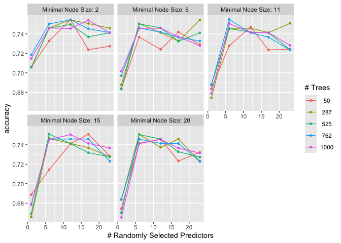<!-- --> \### XGBoost

Our next model focussing on predictive accuraacy is XGBoost. It operates
by sequentially constructing decision trees, where each subsequent tree
aims to correct the errors made by the previous ones. This process is
achieved through gradient descent optimization, which minimizes the
disparity between predicted and actual outcomes. XGBoost also
incorporates regularization techniques, such as penalties and
constraints, which help prevent overfitting and improve model
generalization.

Similarly, 10 fold cross validation and grid search were employed to
tune the hyperparameters and select the most optimal ones. Using XGBoost
resulted in a testing accuraacy of only 0.69.

``` r
set.seed(123) # for reproducibility 
data_train <- final_df_training_data 
data_test <- test_data_df
data_cv <- vfold_cv(data_train, v = 10)

boost <- boost_tree( 
  trees = tune(), 
  tree_depth = tune(), 
  learn_rate = tune()
) %>%
set_mode("classification") %>%
  set_engine("xgboost", objective = "multi:softprob") # using softprob since yields best accuracy

# create this to use in naming in step_dummy
dummy_names_2 <- function (var, lvl, ordinal = FALSE, sep = "") {
  if (!ordinal)
    nms <- paste(var, make.names(lvl), sep = sep)
  else nms <- paste0(var, names0(length(lvl), sep))
  nms 
}

data_recipe <- recipe(outcome ~ ., data = data_train) %>% 
  step_normalize(all_numeric_predictors()) %>% 
  step_dummy(all_nominal_predictors(), one_hot = TRUE, naming = dummy_names_2)

# workflow
workflow_boost <- workflow() %>% 
  add_recipe(data_recipe) %>% 
  add_model(boost)

grid_boost <- grid_regular( 
  trees(range = c(1, 230)), 
  tree_depth(range = c(1, 17)), 
  learn_rate(range = c(-2, -0.001)), 
  levels = 5
)

# tuning
fit_boost <- tune_grid(
  workflow_boost,
  resamples = data_cv,
  grid = grid_boost,
  metrics = metric_set(yardstick::accuracy)
)

# best model
boost_best <- fit_boost %>% 
  select_best(metric = "accuracy")

boost_final <- boost %>% 
  set_args(trees = boost_best$trees,
           tree_depth = boost_best$tree_depth, 
           learn_rate = boost_best$learn_rate)

# Create a new workflow with the final model and the recipe
final_workflow <- workflow() %>% 
  add_recipe(data_recipe) %>% 
  add_model(boost_final)

# Fit the final workflow to the training data
final_fit <- final_workflow %>% 
  fit(data = data_train)

# making the class predictions
predictions <- predict(final_fit, new_data = data_test, type = "prob") 
data_test$.pred_class <- predict(final_fit, new_data = data_test, type = "class")$.pred_class

# confusion matrix
metrics <- yardstick::metrics(data_test, truth = outcome, estimate = .pred_class) 
conf_mat <- yardstick::conf_mat(data_test, truth = outcome, estimate = .pred_class)

# results in knitr
knitr::kable(metrics, caption = "Metrics for XGBoost Model")
```

| .metric  | .estimator | .estimate |
|:---------|:-----------|----------:|
| accuracy | multiclass | 0.6933333 |
| kap      | multiclass | 0.4347969 |

Metrics for XGBoost Model

``` r
knitr::kable(conf_mat$table, caption = "Confusion Matrix for XGBoost Model")
```

|            | died | euthanized | lived |
|:-----------|-----:|-----------:|------:|
| died       |    9 |          0 |    10 |
| euthanized |    2 |          7 |     3 |
| lived      |    4 |          4 |    36 |

Confusion Matrix for XGBoost Model

``` r
boost_best %>% 
  knitr::kable()
```

| trees | tree_depth | learn_rate | .config                |
|------:|-----------:|-----------:|:-----------------------|
|   115 |          5 |  0.0316046 | Preprocessor1_Model033 |

``` r
fit_boost %>% autoplot(resize.extra = 10)
```

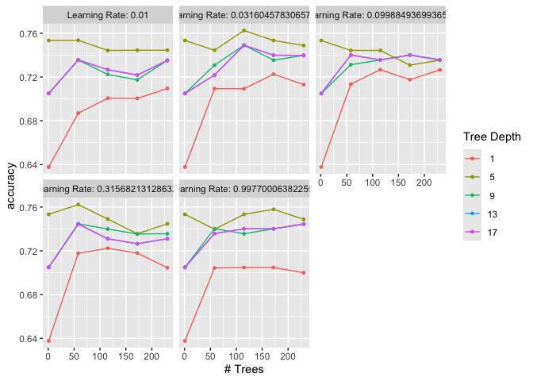<!-- -->

### SVM

Another method we tried was using Support Vector Machines (SVM). This
model finds the best line or boundary to separate different groups of
data points with the maximum margin. These groups are determined by
points closest to the decision boundary, called support vectors. SVMs
can handle both linearly separable and non-linearly separable datasets
through the use of kernel functions, which map the original input space
into a higher-dimensional feature space where separation becomes
possible. Similar to before, grid serach and 10-fold cross validation
was used to find the most optimal hyperparameters. For this dataset,
using SVM achieves a test prediction accuracy rate of 0.66.

``` r
########### SVM

library(tidymodels) 
#install.packages("kernlab") 
library(kernlab) # For svm
```

    ## 
    ## Attaching package: 'kernlab'

    ## The following object is masked from 'package:psych':
    ## 
    ##     alpha

    ## The following object is masked from 'package:scales':
    ## 
    ##     alpha

    ## The following object is masked from 'package:purrr':
    ## 
    ##     cross

    ## The following object is masked from 'package:ggplot2':
    ## 
    ##     alpha

``` r
# reproducibility/splitting the data 
set.seed(123) # for reproducibility 
train_data <- final_df_training_data 
test_data <- test_data_df

recipe <- recipe(outcome ~ ., data = train_data) %>% 
  step_dummy(all_nominal(), -all_outcomes()) %>% 
  step_zv(all_predictors()) %>%
  step_normalize(all_numeric(), -all_outcomes())

# model specification for SVM
svm_spec <- svm_poly(cost = tune(), degree = tune()) %>% 
  set_engine("kernlab") %>%
  set_mode("classification") # since categorical output

workflow <- workflow() %>% 
  add_recipe(recipe) %>% 
  add_model(svm_spec)

cv <- vfold_cv(train_data, v = 10, strata = outcome)

# setting up the tuning grid to get the best parameters
grid <- expand_grid(cost = 10^seq(-3, 2, length.out = 5), 
                    degree = c(1, 2, 3))

# tuning
tune_results <- tune_grid( 
  workflow,
  resamples = cv,
  grid = grid,
  metrics = metric_set(yardstick::accuracy) 
)

# getting best results based on accuracy
best_results <- select_best(tune_results, metric = "accuracy") 
best_cost <- best_results$cost
best_degree <- best_results$degree

# the best model with the best tuned parameters
final_svm_spec <- svm_poly(cost = best_cost, degree = best_degree) %>% 
  set_engine("kernlab") %>%
  set_mode("classification")

# refit on whole training dataset
final_workflow <- workflow() %>% 
  add_recipe(recipe) %>% 
  add_model(final_svm_spec) %>% 
  fit(data = train_data)

predictions <- predict(final_workflow, new_data = test_data, type = "prob")

# getting the class with highest probability
test_data_predictions <- test_data %>%
  select(outcome) %>%
  bind_cols(predictions) %>%
  mutate(pred_class = max.col(select(., -outcome), ties.method = "first"))

# to convert back to factor
levels_pred <- levels(test_data$outcome)
test_data_predictions$pred_class <- factor(test_data_predictions$pred_class, levels = 1:length(levels_pred), labels = levels_pred)

# confusion matrix
metrics <- yardstick::metrics(test_data_predictions, truth = outcome, estimate = pred_class) 
conf_mat <- yardstick::conf_mat(test_data_predictions, truth = outcome, estimate = pred_class)

# print confusion matrix in knitr
knitr::kable(metrics, caption = "Metrics for SVM Model")
```

| .metric  | .estimator | .estimate |
|:---------|:-----------|----------:|
| accuracy | multiclass | 0.6666667 |
| kap      | multiclass | 0.3351064 |

Metrics for SVM Model

``` r
knitr::kable(conf_mat$table, caption = "Confusion Matrix for SVM Model")                                           
```

|            | died | euthanized | lived |
|:-----------|-----:|-----------:|------:|
| died       |   10 |          2 |     8 |
| euthanized |    0 |          2 |     3 |
| lived      |    5 |          7 |    38 |

Confusion Matrix for SVM Model

### Naive Bayes

Another model we fitted was Naive Bayes, this is a probabilistic model
which is based on Bayes’ Thoerem with the “naive” assumption of
independence among the predictors. The model calculates the probability
of a given observation belonging to a particular outcome based on the
probabilities of its features. Despite the simplicity and the assumption
of independence, Naive Bayes performs quite well on this dataset with an
accuracy of 0.72 on the test data.

``` r
library(naivebayes) 
library(caret) 
library(randomForest)

### naive bayes
set.seed(123) # for reproducibility 
train <- final_df_training_data 
test <- test_data_df
bayes_model <- naive_bayes(outcome ~ ., data = train, laplace = TRUE) #, usekernel = T)

# accuracy on training data
bayes_predictions_train <- predict(bayes_model, newdata = train[,-which(names(train)=="outcome")])
accuracy_train <- caret::confusionMatrix(bayes_predictions_train, train$outcome)

# accuracy on testing data
bayes_predictions <- predict(bayes_model, newdata = test[,-which(names(test)=="outcome")]) 
accuracy_test <- caret::confusionMatrix(bayes_predictions, test$outcome)

accuracy_test
```

    ## Confusion Matrix and Statistics
    ## 
    ##             Reference
    ## Prediction   died euthanized lived
    ##   died         14          2    14
    ##   euthanized    0          6     1
    ##   lived         1          3    34
    ## 
    ## Overall Statistics
    ##                                           
    ##                Accuracy : 0.72            
    ##                  95% CI : (0.6044, 0.8176)
    ##     No Information Rate : 0.6533          
    ##     P-Value [Acc > NIR] : 0.136810        
    ##                                           
    ##                   Kappa : 0.5133          
    ##                                           
    ##  Mcnemar's Test P-Value : 0.002564        
    ## 
    ## Statistics by Class:
    ## 
    ##                      Class: died Class: euthanized Class: lived
    ## Sensitivity               0.9333           0.54545       0.6939
    ## Specificity               0.7333           0.98438       0.8462
    ## Pos Pred Value            0.4667           0.85714       0.8947
    ## Neg Pred Value            0.9778           0.92647       0.5946
    ## Prevalence                0.2000           0.14667       0.6533
    ## Detection Rate            0.1867           0.08000       0.4533
    ## Detection Prevalence      0.4000           0.09333       0.5067
    ## Balanced Accuracy         0.8333           0.76491       0.7700

### Best Model: Predictive Accuracy

The model that yielded the highest predictive accuracy for the
missForest dataset is Lasso with an accuracy of 0.70, which is better
than the baseline with an accuracy of 0.65. However, it is still
possible to increase the accuracy. . . .

**Without Merging**

To enhance the predictive accuracy of our models, we decided to rerun
them using a dataset where all levels in the categorical predictors
remained unmerged. We merged levels initially to improve
interpretability, due to both the low number of observations for some
levels within each categorical predictor and to enhance model
interpretability. However, merging levels in categorical predictors
reduces accuracy, as it potentially reduces the predictive strength of
individual levels and loses valuable information essential for
classification. Since this task focused on predictive accuracy, the
original levels were retained to prevent information loss due to merging
levels.

``` r
# for unmerged-complete case

# Removing columns with more than 15% missing values

nas_per_column <- sapply(pre_merge_df, function(x) sum(is.na(x)) / nrow(pre_merge_df)) 
columns_to_remove <- names(nas_per_column[nas_per_column > 0.15])

pre_merge_df_clean <- pre_merge_df[, !(names(pre_merge_df) %in% columns_to_remove)] 

unmerged_complete_case_df <- pre_merge_df_clean[complete.cases(pre_merge_df_clean), ]
```

Running an elastic net model on the unmerged dataset

``` r
####### Elastic Net
library(tidymodels) 
library(glmnet)

# reproducibility/splitting the data

set.seed(123) # for reproducibility
data_split <- initial_split(unmerged_complete_case_df, prop = 0.75) 
train_data <- training(data_split)
test_data <- testing(data_split)

recipe <- recipe(outcome ~ ., data = train_data) %>% 
  step_dummy(all_nominal(), -all_outcomes()) %>% 
  step_zv(all_predictors()) %>% 
  step_normalize(all_numeric(), -all_outcomes())

# making the model specification for multinomial logistic regression using elastic net
elastic_net_spec <- multinom_reg(penalty = tune(), mixture = tune()) %>% 
  set_engine("glmnet") %>%
  set_mode("classification")

# workflow
workflow <- workflow() %>% 
  add_recipe(recipe) %>% 
  add_model(elastic_net_spec)

cv <- vfold_cv(train_data, v = 5, strata = outcome)

# setting up the tuning grid to use for the tuning
grid <- crossing(
  penalty = seq(-6, -1, length.out = 5) %>% map(~10^.) %>% unlist(), 
  mixture = seq(0, 1, length.out = 5)
)


tune_results <- tune_grid( 
  workflow,
  resamples = cv,
  grid = grid,
  metrics = metric_set(yardstick::accuracy) 
)

# to get the best result based on accuracy
best_results <- select_best(tune_results, metric = "accuracy") 
best_lambda <- best_results$penalty
best_mixture <- best_results$mixture

# making the model again using the best lambda and mixture
final_elastic_net_spec <- multinom_reg(penalty = best_lambda, mixture = best_mixture) %>% 
  set_engine("glmnet") %>%
  set_mode("classification")

# refit on the whole training dataset
final_workflow <- workflow() %>% 
  add_recipe(recipe) %>% 
  add_model(final_elastic_net_spec) %>% 
  fit(data = train_data)

predictions <- predict(final_workflow, new_data = test_data, type = "prob")

# getting the highest probability prediction
max_prob <- apply(predictions %>% select(starts_with(".pred_")), 1, which.max) 
test_data$.pred_class <- levels(test_data$outcome)[max_prob]

# getting the model metrics
metrics <- sum(test_data$.pred_class == test_data$outcome) / nrow(test_data) 
print(metrics)
```

    ## [1] 0.8571429

``` r
library(yardstick)

# confusion matrix
test_data$.pred_class <- as.factor(test_data$.pred_class)
conf_matrix <- conf_mat(test_data, truth = outcome, estimate = .pred_class)

# printing in knitr
knitr::kable(conf_matrix$table, caption = "Confusion Matrix for Elastic Net Model")
```

|            | died | euthanized | lived |
|:-----------|-----:|-----------:|------:|
| died       |    5 |          0 |     0 |
| euthanized |    0 |          1 |     0 |
| lived      |    6 |          1 |    36 |

Confusion Matrix for Elastic Net Model

Utilising complete case data and dropping columns with 15% missing
values, we conducted the analysis. Interestingly, most models
demonstrated higher accuracy, with many surpassing 0.8 (see Table 24).
Notably, the elastic net model achieved a remarkable test accuracy of
0.86. Previously, achieving predictive accuracy above 0.8 was
challenging with the dataset containing merged levels in categorical
predictors. Removing the merging has significantly improved test
predictive accuracy.

``` r
# Creating a dataframe for unmerrged_case without SMOTE
df1 <- data.frame(
Model = c("multinominal", "single_tree", "random_forest", "xgb_boost",
          "lasso", "lasso_interaction_age_surgery", "ridge", "elastic_net", "svm",
          "stochastic_gradient_descent", "bayes_naive_model"),
Accuracy = c(0.78, 0.82, 0.80, 0.82, 0.82, 0.82, 0.76, 0.86, 0.78, 0.63, 0.68)
)

knitr::kable(df1, caption = "Model Accuracies using unmerged_complete_case (without SMOTE)")
```

| Model                         | Accuracy |
|:------------------------------|---------:|
| multinominal                  |     0.78 |
| single_tree                   |     0.82 |
| random_forest                 |     0.80 |
| xgb_boost                     |     0.82 |
| lasso                         |     0.82 |
| lasso_interaction_age_surgery |     0.82 |
| ridge                         |     0.76 |
| elastic_net                   |     0.86 |
| svm                           |     0.78 |
| stochastic_gradient_descent   |     0.63 |
| bayes_naive_model             |     0.68 |

Model Accuracies using unmerged_complete_case (without SMOTE)

## Findings

These are the final findings after running all the models with and
without SMOTE.

``` r
# Creating a dataframe for all models with SMOTE
df2 <- data.frame(
Model = c("multinominal", "single_tree", "random_forest", "xgb_boost", "lasso",
          "lasso_interaction_age_surgery", "ridge", "elastic_net", "svm",
          "stochastic_gradient_descent", "bayes_naive_model"),
complete_case = c(0.65, 0.63, 0.67, 0.63, 0.65, 0.65, 0.65, 0.65, 0.63, 0.59, 0.59), 
missForest = c(0.65, 0.71, 0.73, 0.73, 0.68, 0.69, 0.69, 0.71, 0.68, 0.51, 0.69), 
mean_mode_impute = c(0.65, 0.67, 0.72, 0.68, 0.69, 0.69, 0.67, 0.69, 0.63, 0.5, 0.68)
)

# printing the df
knitr::kable(df2, caption = "Model Accuracies Across Different Imputation Methods (with SMOTE)")
```

| Model                         | complete_case | missForest | mean_mode_impute |
|:------------------------------|--------------:|-----------:|-----------------:|
| multinominal                  |          0.65 |       0.65 |             0.65 |
| single_tree                   |          0.63 |       0.71 |             0.67 |
| random_forest                 |          0.67 |       0.73 |             0.72 |
| xgb_boost                     |          0.63 |       0.73 |             0.68 |
| lasso                         |          0.65 |       0.68 |             0.69 |
| lasso_interaction_age_surgery |          0.65 |       0.69 |             0.69 |
| ridge                         |          0.65 |       0.69 |             0.67 |
| elastic_net                   |          0.65 |       0.71 |             0.69 |
| svm                           |          0.63 |       0.68 |             0.63 |
| stochastic_gradient_descent   |          0.59 |       0.51 |             0.50 |
| bayes_naive_model             |          0.59 |       0.69 |             0.68 |

Model Accuracies Across Different Imputation Methods (with SMOTE)

``` r
df3 <- data.frame( Model = c(
    "multinominal", "single_tree", "random_forest", "xgb_boost",
    "lasso", "lasso interaction (age*surgery)", "ridge",
    "elastic_net", "svm", "stochastic_gradient_descent", "bayes_naive_model"
),

complete_case = c(0.76, 0.69, 0.67, 0.65, 0.74, 0.76, 0.72, 0.72, 0.7, 0.63, 0.63), 
missforest = c(0.64, 0.68, 0.71, 0.75, 0.73, 0.73, 0.72, 0.72, 0.68, 0.6, 0.72), 
mean_mode_impute = c(0.69, 0.59, 0.69, 0.75, 0.73, 0.72, 0.68, 0.71, 0.67, 0.58, 0.65)
)

# Print the dataframe
knitr::kable(df3, caption = "Model Accuracies Across Different Imputation Methods (without SMOTE)")
```

| Model                            | complete_case | missforest | mean_mode_impute |
|:---------------------------------|--------------:|-----------:|-----------------:|
| multinominal                     |          0.76 |       0.64 |             0.69 |
| single_tree                      |          0.69 |       0.68 |             0.59 |
| random_forest                    |          0.67 |       0.71 |             0.69 |
| xgb_boost                        |          0.65 |       0.75 |             0.75 |
| lasso                            |          0.74 |       0.73 |             0.73 |
| lasso interaction (age\*surgery) |          0.76 |       0.73 |             0.72 |
| ridge                            |          0.72 |       0.72 |             0.68 |
| elastic_net                      |          0.72 |       0.72 |             0.71 |
| svm                              |          0.70 |       0.68 |             0.67 |
| stochastic_gradient_descent      |          0.63 |       0.60 |             0.58 |
| bayes_naive_model                |          0.63 |       0.72 |             0.65 |

Model Accuracies Across Different Imputation Methods (without SMOTE)

## Conclusions

Fitting various models on the horse dataset revealed that different
models are suitable for different scenarios. It completely depends on
your ultimate goal for utilising these machine learning methods. A model
that focuses on predictive accuracy can aid clinical judgement by
assessing the likely outcome of the horse. Conversely, more
interpretable models may benefit veterinarians and researchers in better
understanding possible correlations and causes of a horse’s outcome.

In summary, while the multinomial logistic regression model serves as a
good baseline, fitting more advanced machine learning models can improve
the predictive accuracy on unseen data. On the other hand, decision
trees and regression models help us understand the effects of each
predictor on the outcome, offering valuable insights into the predictors
with the greatest predictive power. Different models are suited for
different scenarios, and there is no “one-size-fits-all” solution.

### Predictive Power: Explaining the Findings

For the complete case (without SMOTE), the multinomial and lasso
interaction models have the highest accuracy of 0.76. Using missForest,
lasso gives the highest accuracy of 0.70. Finally, using mean mode
input, we get a highest accuracy also of 0.75 from XGBoost again.

Using SMOTE, the random forest model returns the highest accuracy using
the complete case, the missForest and the mean/mode imputed dataset.
Without using SMOTE, the random forest model accuracy performs averagely
compared to other models. This can be explained by the ability of the
random forest to be robust to class imbalances due to its ensemble
nature. The oversampling introduced by SMOTE only enhances its
discriminatory power, leading to better performance in the SMOTE
scenario.

The boost model (XGBoost) returns the same level of accuracy to the
random forest model (0.73) when using the missForest dataset. However,
the boost model performs on the lower end against other models regarding
accuracy when using the complete case and mean/mode imputation datasets.

In the case in which we forego using SMOTE, the boost model returns the
highest accuracy using the missForest and mean/mode imputed datasets but
underperforms in the complete case. Since boosting models thrive when
they have access to complete and informative data, not using SMOTE in
the absence of data points within the complete case scenario
substantially impacts the predictive accuracy of the boost model.

Without using SMOTE, other models that exhibit strong predictive
accuracy against the other models include the multinominal and lasso
model (which includes the interaction between age and surgery), however
this occurs only in the complete case, with the multinominal showing
larger losses to predictive accuracy in the missForest and mean/mode
imputation case.

Finally, eliminating the merging of categorical variables significantly
enhances test accuracy by mitigating information loss in a dataset
already facing challenges related to missing values. The effect of
eliminating the merging can be further investigated with more advanced
models such as neural networks to see if we can potentially improve the
predictive accuracy. Although, this will severely reduce the
interpretability of the models.

In summary, although the Elastic Net model without merging categorical
predictors achieves a test accuracy of 0.86 with the test dataset, the
boosting model stands out as a strong performer across various
scenarios. It consistently delivers the highest accuracy, whether with
or without SMOTE, and remains robust against class imbalances and
different imputation models. Further fine-tuning of the boosting model
could likely solidify its position as the top-performing model on
average, warranting additional exploration and optimization.

### Interpretability

When the objective is to enhance interpretability, opting for models
like multinomial logistic regression and decision trees proves
advantageous. These models offer insights into the key factors
influencing a horse’s survival, facilitating an understanding of how
various predictor variables contribute to the outcome. Specifically,
multinomial logistic regression provides coefficient estimates, allowing
researchers to discern the impact of predictor variables on different
outcome categories. Decision trees, on the other hand, present a clear
hierarchical structure, enabling easy visualization and interpretation
of decision-making processes.

Moreover, supplementing these approaches with techniques such as
variable importance plots for tree-based methods enhances
interpretability further. These plots highlight the most influential
predictors in the decision-making process, offering valuable insights
into the underlying patterns driving the model’s predic- tions.
Additionally, employing penalized regression models, such as Lasso or
Ridge regression, can provide a balance between interpretability and
predictive accuracy. These models penalize the coefficients of less
important predictors, effectively simplifying the model and aiding in
the identification of the most relevant predictors. By leveraging these
strategies, researchers can gain comprehensive insights into the
predictors with the greatest predictive power while maintaining
interpretability.

### Limitations

#### Imputation Techniques and Missing Data:

The primary challenge presented by our dataset is the significant number
of missing values. To address this, we utilised imputation techniques
such as missForest and imputation of missing values with their mean or
mode. However, these methods typically assume that the data are missing
at random, an assumption that may not always hold true. Imputing missing
values can introduce biases, especially if the missingness is
systematically related to unobserved data. Moving forward, an approach
worth considering is to categorise missing data as a distinct category.
This method allows for a direct treatment of missingness without relying
on the assumption of randomness in the missing data.

#### SMOTE for Imbalanced Classes:

SMOTE is instrumental in mitigating class imbalance through the creation
of synthetic examples. However, this technique can potentially introduce
bias by over-generalizing the characteristics of the minority class.
Additionally, there’s a heightened risk of model over fitting to the
minority class, particularly if the synthetic instances don’t accurately
reflect real-world situations. An intriguing observation from our
analysis is that, on average, models performed better on the test data
without the application of SMOTE across all datasets (complete case,
missForest, and mean/mode). This suggests that while SMOTE can be
beneficial for balancing class distribution, its synthetic augmentation
might not always align with the underlying distribution of real-world
data, possibly leading to less effective generalisation on unseen data.

#### Generalisability

The models were trained and validated on a specific dataset. While
efforts were made to handle missing data and class imbalance, the
models’ ability to generalize to other datasets or real-world scenarios
is uncertain. The dataset’s size and feature space might limit the
models’ applicability to broader or significantly different populations.

#### Hyperparameter Tuning

The process of hyperparameter tuning, especially using grid search can
be exhaustive and might not always lead to the global optimum. One
method to combat this would be to use other methods such as ran- dom
search. Alternatively, more advanced methods like Bayesian optimization
or genetic algorithms could potentially offer better tuning in order to
find a model with better predictive powers.
